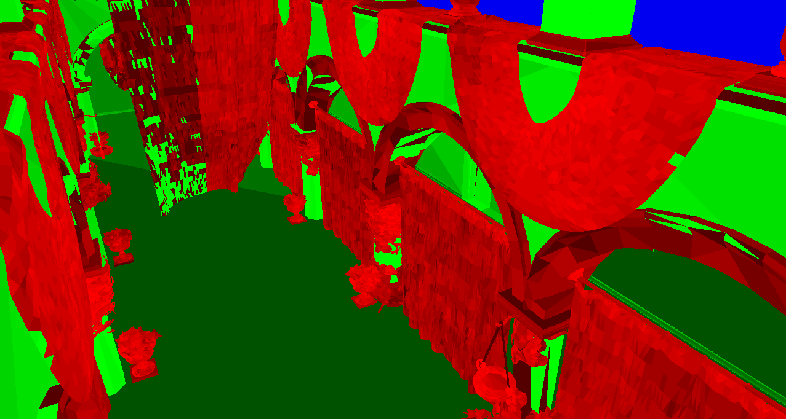
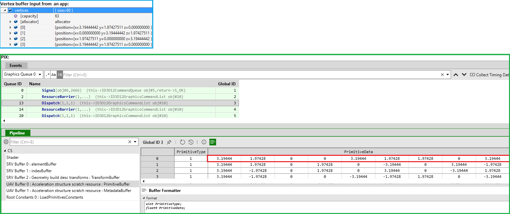

# Fallback Layer Developer Guide
For a general introduction to DXR, refer to the official spec. This section only calls out the difference between the DX12 API and the Fallback layer's API.

The Fallback Layer provides the entire set of interfaces needed for DX12 ray tracing in D3D12RaytracingFallback.h. These interfaces are intended to be near-copies of the official DXR interfaces, however several modifications have been made to make emulation of DXR possible. For uses of the Fallback Layer, developers are encouraged to reference the samples.

## Definitions
The Fallback Layer supports two paths commonly referred to in the readme as:
### 1. DXR API Path
This path is used when the Fallback Layer detects that the OS + GPU have support for using the native DirectX Raytracing API. The Fallback Layer interfaces are implemented as pass-through functions to the corresponding DirectX API.

### 2. Compute-based Path
This path is used when the Fallback Layer detects the OS + GPU do *not* support the DirectX Raytracing API. Instead, it will use the DirectCompute API to emulate Raytracing capabilities. It is expected that this path with be slower than the DXR API path due to lack of fixed-function/driver-optimizations.

## Fallback Layer Integration
For use in a project outside of the samples, the Fallback Layer is a stand-alone static lib in FallbackLayer/(debug|release)/FallbackLayer.lib that can be compiled into other DX projects. In addition, some Fallback Layer logic exists in the Dxil Compiler Repo, and so projects should also always use the DxrFallbackCompiler.dll bundled with the Fallback Layer.

## Fallback Layer Interface differences
This is an outline of the major concepts that differ from DXR.

### Emulated GPU Pointers
The primary point of divergence between the DXR API and the compute-based Fallback layer is the handling of GPU pointers. DXR fundamentally requires that GPUs be able to dynamically read from arbitrary addresses in GPU memory (details in *Emulated Pointers Implementation*). The existing Direct Compute API today is more rigid than DXR and requires apps to explicitly inform the GPU what blocks of memory it will access with Shader Resource Views/Unordered Access Views. In order to handle the requirements of DXR, the Fallback Layer uses the concept of Emulated GPU pointers, which requires apps to create views around all memory they will access for raytracing, but retains the DXR-like flexibility of only needing to bind the top level acceleration structure at `DispatchRays`.

The Fallback Layer interface uses `WRAPPED_GPU_POINTER` to encapsulate the underlying pointer which will either be an emulated GPU pointer for the compute-based path or a GPU_VIRTUAL_ADDRESS for the DXR path. 

The easiest way to make a Wrapped GPU pointer to a resource is:

```WRAPPED_GPU_POINTER ID3D12RaytracingFallbackDevice::GetWrappedPointerSimple(UINT32 DescriptorHeapIndex, D3D12_GPU_VIRTUAL_ADDRESS GpuVA)```. 

*DescriptorHeapIndex* - an index into the descriptor heap where the UAV for the resource will live.

*GpuVA* - The GPU virtual address of the resource.

The value returned from `GetWrappedPointerSimple` can be treated similarly to a D3D12_GPU_VIRTUAL_ADDRESS, including adding offsets to it to enable techniques like sub-allocating multiple acceleration structures that live within one larger resource. 

The views created for bottom/top level acceleration structures must be Unordered Access Views created as raw buffers.

There are two scenarios that require the use of Wrapped GPU pointers:
##### 1. BuildRaytracingAccelerationStructure for top level Acceleration Structures

The following must be a WRAPPED_GPU_POINTER rather than a GPU_VIRTUAL_ADDRESS:
```D3D12_RAYTRACING_INSTANCE_DESC::AccelerationStructure```

If this descriptor is being generated on the CPU, the Fallback Layer provides a mirror class that ```D3D12_RAYTRACING_FALLBACK_INSTANCE_DESC``` that should be used instead. This will ensure that initializing this member directly with a D3D12_GPU_VIRTUAL_ADDRESS will result in a compile-time error.

If D3D12_ELEMENTS_LAYOUT_ARRAY_OF_POINTERS is used with a top level acceleration structure, the array of pointers must also be an array of `WRAPPED_GPU_POINTER`'s rather than `D3D12_GPU_VIRTUAL_ADDRESS`. Since the instance descs read in this case are read only, the view created around this memory should be an SRV.

##### 2. Using a Root Descriptors in the Local Root Signature
*Not currently supported, but will be in future releases of the Fallback Layer.*

Root descriptors specified through shader records must be `WRAPPED_GPU_POINTER`'s rather than `D3D12_GPU_VIRTUAL_ADDRESS`.

#### Porting tips

Developers may find that the requirement for emulated pointer descriptors to be persistent in a descriptor heap will require changes to core engine code that handles descriptor heaps. This is particularly true of engines that are not bind-less and use stack-style allocation of descriptors to do DX11-style binding.

In order to add support for emulated pointers, a couple of approaches exist:
##### Unique Descriptor Heap for Raytracing
Pros:
* Relatively easy to add to engines where the Descriptor Heap code maybe deeply embedded in engine code managing the descriptor allocation.
* Easy to ensure that the persistence of emulated pointers has been baked into Acceleration Structures.

Cons:
* Requires large amount of duplication of views to texture resources that would otherwise already exist in the Descriptor Heaps used by the main engine.

##### Reserve a region of the Descriptor Heap for Raytracing
Pros:
* Allows for sharing views of texture resources used by the main/graphics engine.

Cons:
* Requires knowing ahead of time how much to carve out of Descriptor Heaps for raytracing or some dynamic partitioning scheme.
* If engine's use a stack-style allocation of descriptors in the descriptor heap, it may require frequently copying around Raytracing-specific views across descriptor heaps.

#### Advanced usage of Wrapped Pointers

`GetWrappedPointerSimple` provides an interface that will work seamlessly on both the DXR API and the Compute-based path without any need on the app's behalf to distinguish between the two. However, at first glance the parameters passed to `GetWrappedPointerSimple` appear redundant, as both parameters are stand-alone ways to refer to a resource. This is due to the compute-based path only requiring the descriptor heap index, and the DXR path only requiring the GPU VA. An app can call:

```bool ID3D12RaytracingFallbackDevice::UsingRaytracingDriver();```

as a means of distinguishing the two and then determine whether to call:

```
// Pre-condition: UsingRaytracingDriver() must be false
WRAPPED_GPU_POINTER ID3D12RaytracingFallbackDevice::GetWrappedPointerFromDescriptorHeapIndex(UINT32 DescriptorHeapIndex, UINT32 OffsetInBytes = 0);

// Pre-condition: UsingRaytracingDriver() must be true
WRAPPED_GPU_POINTER ID3D12RaytracingFallbackDevice::GetWrappedPointerFromGpuVA(D3D12_GPU_VIRTUAL_ADDRESS gpuVA);
```
This can be particularly helpful for cases where the DXR API path is being used and there is no need to allocate UAVs to all referenced acceleration structures since the DXR path ignores the descriptor heap index.

### SetDescriptorHeap
One consequence of the dependence on emulated pointers is the requirement that the app bind a Descriptor Heap when either calling `BuildRaytracingAccelerationStructure` or `DispatchRays`. This call to set descriptor heaps must be through `ID3D12RaytracingFallbackCommandList::SetDescriptorHeaps` and not `ID3D12GraphicsCommandList::SetDescriptorHeaps`.

### Compute Bindings
When any of the following calls are made, all existing compute bindings are invalidated:
* `BuildRaytracingAccelerationStructure`
* `EmitRaytracingAccelerationStructurePostBuildInfo`
* `CopyRaytracingAccelerationStructure`

This is due to the need for the FallbackLayer to set its own internal Root Signature that will invalidate the app's root signature + bindings.

### Root Signatures
Root Signatures used for raytracing must go through `ID3D12RaytracingFallbackDevice::D3D12SerializeRootSignature/ID3D12RaytracingFallbackDevice::D3D12SerializeVersionedRootSignature/ID3D12RaytracingFallbackDevice::CreateRootSignature` interfaces. These are required by the Fallback Layer to inject extra internally-required bindings. These are identical to the native D3D12 equivalent, with the exception of the Serialize calls which do require a device object.

### Binding Acceleration Structures
Binding an acceleration structure is more rigid in the Fallback Layer and must go through the `ID3D12RaytracingFallbackDevice::SetTopLevelAccelerationStructure` interface. This interface exposes a `SetComputeShaderResourceView`-style method of binding the acceleration structure. This does not allow for apps to bind using `SetComputeRootDescriptorTable`-style bindings or using local root signatures.

### Resource States
The resource state for an acceleration structure should be queried from `ID3D12RaytracingFallbackDevice::GetAccelerationStructureResourceState`. Per the DXR API guidelines, an acceleration structure's underlying resource must stay in this state for the duration of the resource's lifetime. A D3D12_RESOURCE_BARRIER_TYPE_UAV resource barrier is required in between calls to:
* `BuildRaytracingAccelerationStructure`
* `EmitRaytracingAccelerationStructurePostBuildInfo`
* `CopyRaytracingAccelerationStructure`
* `DispatchRays`

Note: `DispatchRays`/`EmitRaytracingAccelerationStructurePostBuildInfo` are read-only operations for the acceleration structure, and so UAV barriers are not necessary when using these 2 interfaces successively.

## Fallback Layer Implementation
These details give a high-level overview of the implementation of the Fallback Layer. While these details are not strictly necessary to understand how to use the Fallback Layer interfaces, these provide the underlying design decisions behind the interfaces.

### Scheduling State Machine
Dispatching rays involves interleaving fixed-function traversal of Acceleration Structures with user supplied raytracing shaders. In order to maximize flexibility in scheduling the execution of these activities, the Fallback Layer uses a state machine. A state machine can simulate control flow not normally allowed in HLSL such as recursion and exceptions. It also enables optimizations such as opportunistic reconvergence where threads in the same wave may share execution of a the same state even though they are in different phases of execution. For example, some threads that have already hit a surface may trace reflection rays at the same time as other threads in the wave that are still tracing primary rays.

The details of the implementation of the state machine are out-of-scope for this document, but at a high level this is handled by transforming shaders into state functions that pull parameters off a per-thread allocated stack, splitting the state functions at calls to TraceRay() and other shaders, and replacing the calls with continuations. Live variables are saved and restored to the stack before and after the continuations. The state machine itself is formed by linking the state functions together into a single compute shader. The logic for these transformations exists outside of the Fallback Layer in a Fallback-specific compiler built into the DXIL compiler.

### Acceleration Structures
Acceleration Structures are created as UAV raw buffers, and kept in a UAV state for the entirety of the app. Acceleration Structures in the Fallback Layer are arranged as Bounding Volume Hierarchies (BVH) which are made up of a tree of axis-aligned bounding boxes (AABBs). The UAV buffer is split multiple lists (list of AABBs, list of leaves (either triangles or bottom level acceleration structures), and a list of leaf metadata), as well as a header at the top of the buffer that contains the offsets to each list. The implementation of how the Acceleration Structures are built are through a series of compute shaders that sort the geometry to be spatially coherent.

### Emulated Pointers Implementation
The DXR API has a built-in requirement that drivers dynamically interpret GPU virtual addresses from a shader, something that does not exist in HLSL today. This requirement is most visible in the design of top-level and bottom-level acceleration structures. A top-level acceleration structure can reference bottom level acceleration structures allocated in arbitrary points in memory. When an app calls DispatchRays(), it is only required to bind the top-level acceleration structure. As a result, when the shader traces the ray in a top-level acceleration structure and determines it needs to traverse to a bottom-level acceleration structure, it needs to be able to read from a pointer to memory not explicitly bound by the app. 

For compute shaders, which do not support the direct use of GPU pointers, this presents a challenge. Some help from the app is required to "emulate" pointers. In place of a GPU virtual address the app encodes a descriptor heap index and an offset in bytes. The Fallback Layer requires apps to create a UAV to any resource that is referenced by pointers, thus ensuring that all the bottom-level resources are bound. The Fallback Layer patches root signatures used for raytracing to have an additional bindless descriptor table that spans the entire descriptor heap. A bottom-level acceleration structure can then be accessed by using an emulated pointer to dynamically index into the added descriptor table.

## Performance Guide

### Pack as much geometry into a single Bottom Level Acceleration Structure as possible
Good ray traversal performance comes from being able to quickly find the closest occluding geometry and eliminating all geometry beyond that occluder. By putting all geometry into a single acceleration structure, the Fallback Layer can ensure that geometry is sorted for optimally finding occluders first. However, this sorting can only be done locally within a single acceleration structure, and so unnecessarily splitting geometry into acceleration structures should only be done when absolutely necessary. The general guidance is that all static geometry should be in one acceleration structure, with dynamic meshes varying based on update frequency.

### Use D3D12_RAYTRACING_ACCELERATION_STRUCTURE_BUILD_FLAG_PREFER_FAST_TRACE if you can
The extra time afforded for Acceleration Structure Optimization can get up to 2x wins on traversal time

### Avoid "live values" after a TraceRay()
Per the *Scheduling State Machine* section, a TraceRay() invocation requires that all variables assigned before a TraceRay() must be recovered off the stack after the TraceRay() invocation. The cost for live-values is twice-fold: the shader must pay the cost of storing and restoring values of a stack AND the shader's memory footprint is increased due to the requirement of a larger stack.

As an example:
```
RWTexture2D<float4> g_Output;
[shader("raygeneration")]
void RayGen()
{
    float foo = CalculateSomething(); // This needs to be saved off on a stack
    RayPayload payload;
    payload.color = 0.0;
    TraceRay(..., payload);
    g_Output[coord] = foo * payload.Color; // foo must be retrieved off the stack
}
```

In contrast to this case where foo is baked into the payload so it's no longer a live-value
```
[shader("raygeneration")]
void RayGen()
{
    float foo = CalculateSomething();
    RayPayload payload; 
    payload.color = foo;
    TraceRay(...); // No need to save foo because it's not used after TraceRay().
    g_Output[coord] = payload.Color; 
}
```

While the above is an overly simplified example, the example points out the introduction of live-values can be subtle and easily unintended. Developer should be vigilant of avoiding the addition of live-values when possible.

### Avoid unnecessary inclusions of AnyHit/Intersection shaders in a State Object whenever possible
The use of an AnyHit/Intersection shader require that the traversal code must stop it's current travesal, save its state, and invoke a shader, and then based on the result, determine if it needs to resume traversal. Even if an AnyHit/Intersection shader is never invoked, just overhead of needing to account for the possible invocation of an AnyHit/Intersection shader can be expensive. The Fallback Layer uses a streamlined traversal shader when a State Object is provided that has no AnyHit shaders (roughly a 20% performance improvement).

## Known Issues & Limitations

* #### NV 397.31+ drivers do not properly support compute Fallback Layer on Nvidia Volta. Use the recommended DXR / driver based raytracing mode on this configuration instead.

* #### Indexing in shaders is not supported for buffers specified via root descriptor tables in local root signature
  
* #### Limited Local Root Signature Support for Root Descriptors
Root Descriptors are partially supported, however currently the offset in bytes portion of the pointer will always be ignored and it will only read from the start of the buffer. 

In addition, to enable root descriptors in the first place, developers must pass in CreateRaytracingFallbackDeviceFlags::EnableRootDescriptorsInShaderRecords to D3D12CreateRaytracingFallbackDevice to enable this functionality.

* #### Depth value of DispatchRays is ignored

* #### No Callable shaders
Callable shaders are not yet supported. 

* #### D3D12_RAYTRACING_ACCELERATION_STRUCTURE_BUILD_FLAGS for compaction are ignored
Both D3D12_RAYTRACING_ACCELERATION_STRUCTURE_BUILD_FLAG_ALLOW_COMPACTION and D3D12_RAYTRACING_ACCELERATION_STRUCTURE_BUILD_FLAG_MINIMIZE_MEMORY are ignored by the Fallback Layer

* #### D3D12_RAYTRACING_ACCELERATION_STRUCTURE_COPY_MODE_COMPACT is ignored

Compacting Acceleration Structures is treated as a normal copy and will not reduce the size of the Acceleration Structure

* #### No Support for Subobjects Specified in HLSL

* #### App-provided Pipeline-state stack size
The stack size passed by `SetPipelineStackSize` is ignored and the Fallback instead uses a worst-case calculated stack size based on the max recursion count provided in the state object

* #### Only one AccelerationStructure can be bound per call to DispatchRays()

* #### Use of the Shader Record is thrown off when using an empty ray payload

* #### D3D12_RAYTRACING_GEOMETRY_FLAG_OPAQUE doesn't prevent Any-Hit invocation from getting called on geometry using Intersection Shaders
Note: On regular triangle geometry, all opaque/non-opaque flags should still work as expected
 
## Debugging & Tooling
The Fallback Layer natively works with PIX. However, PIX does not have support for using ray tracing debugging capabilities with the Fallback and will instead show all operations as the underlying compute shader dispatches. Debugging more advanced problems will require a more in-depth knowledge of how the Fallback works. This section include guidelines on how to go about investigating different problem areas.

When using the debug version of the Fallback Layer library, the Fallback layer has limited validation that will catch unsupported cases and output the cause of failure to the debugger. 

### Acceleration structure visualization
It can be helpful to visualize the acceleration structure, particularly when you make changes to the structure logic in the library. To do this, enable ENABLE_ACCELERATION_STRUCTURE_VISUALIZATION in [FallbackDebug.h](src/FallbackDebug.h) and in [ModelViewerRayTracing.h](../../Samples/Desktop/D3D12Raytracing/src/D3D12RaytracingMiniEngineSample/ModelViewerRayTracing.h).

The visualization shows the depth of each triangle in the BVH, starting with the root of the top-level acceleration structure. Blue triangles are located at depths of 0-9 levels deep, green triangles are at 10-21 levels deep, and red triangles are at 22-31 levels deep. Darker colors imply deeper triangles (thus longer ray traversals to intersection) in each range.
```c
// Set to 1 to visualize acceleration structure. 
// Since this writes to a raytracing output during ray traversal, 
// the Fallback Layer must have an output that is used by the application defined and
// an application shaders must disable writing to the output (i.e. in a miss/hit shaders).
#define ENABLE_ACCELERATION_STRUCTURE_VISUALIZATION 0
```


### Debugging vertex input to Acceleration structure build
First, make sure that an AS build is part of the frame when you collect a PIX capture. Then look at a first Dispatch call corresponding to the AS build and see the *PrimitiveBuffer* UAV with the passed in vertex data in PIX's Pipeline view (see below). The format of the buffer corresponds to the *Primitive* object defined in [RayTracingHlslCompat.h](src/RayTracingHlslCompat.h) which is {PrimitiveType + primitive data} (see below). For a triangle primitive that is going to be {TRIANGLE_TYPE, three XYZ vertices}. Note TRIANGLE_TYPE has a value of 1 from the define.

```c
#define TRIANGLE_TYPE 0x1
#define PROCEDURAL_PRIMITIVE_TYPE 0x2
struct Primitive
{
    uint PrimitiveType;
#ifdef HLSL
    uint4 data0;
    uint4 data1;
    uint data2;
#else
    union
    {
        Triangle triangle;
        AABB aabb;
    };
#endif
```

Here's an example of a vertex buffer input in Visual Studio and then a corresponding view in PIX, with the first triangle primitive highlighted in red.



## Roadmap
Initial development is expected to focus on some of the major functional gaps outlined in *Known Issues & Limitations*.

There is also a significant opportunity left for performance. As of this release, little time has been afforded for performance, and it's expected that optimizations here could greatly multiply performance. Some examples of performance work are listed below. 

Performance opportunities:
* Optimize for NO_DUPLICATE_ANY_HIT  (Triangle spatial splitting)
* Compressed-wide BVH nodes
* Use ExecuteIndirect with *simple* StateObjects 

Given the nature of raytracing and the breadth of techniques the API exposes, there is an endless amount of performance work that can be done. Developers interested in using the Fallback Layer for a specific scenario are welcome to reach out (contact information in the *Feedback* section).

## Workitems

### Functional work:
Functional work includes resolving gaps already laid out in *Known Issues & Limitations*

### Performance work:
#### Add Triangle Splitting
Implement triangle splitting for better handling of large-thin triangles that sabotage the use of AABBs: [reference](http://www.nvidia.com/docs/IO/77714/sbvh.pdf)

#### Multiple triangles per leaf node
Currently there is only ever 1 triangle per leaf node. In some cases, the cost of traversing each leaf's individual bounding box may outweigh the cost of simply having an encompassing bounding box that contains a list of many triangles. A Surface Area Heuristic-style check should be used to determine when to combine triangles

#### Restructure AABB nodes
AABB nodes are arranged in a non-optimal format for the traversal. Each AABB contains the parent AABB and indices to the child AABBs. However when determining which child to traverse first, it also has to read both child nodes. Both child AABBs should be stored in the parent node so that only one node read is required

#### Profiling Acceleration Structure builds
So far, acceleration structure build times have not been a priority, and so little time has been spent investigating the cost of acceleration structure builds.

#### BVH build Sort using a parallel Radix Sort
The current implementation uses a bitonic sort, but it's suspected bigger wins could be made on Acceleration Structure build by using a radix sort.      

## Building and running the Fallback Layer Unittests
Changes made to the Fallback Layer should be verified by running through the Fallback Layer unittests. The unittests can be built by building the FallbackLayerUnitTest project. The unittests use the Visual Studio framework, and are run natively as a part of Visual Studio. The test window can be viewed by going to Test->Windows->Test Explorer. After building the unittests, the Test Explorer should show a list of tests that can be run. All tests can then be run by hitting "Run All" at the top left of the Test Explorer window.

* You may need to also change the Visual Studio test architecture to x64. You can do this by going to Test->Test Settings->Default Processor Architecture->x64   
