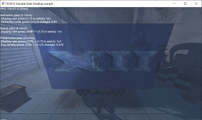

# DirectX-Graphics-Samples
This repo contains the DirectX 12 Graphics samples that demonstrate how to build graphics intensive applications for Windows 10. We invite you to join us at our [discord server](http://discord.gg/directx). See our [YouTube channel](https://www.youtube.com/MicrosoftDirectX12andGraphicsEducation) for tutorials, our [spec repo](https://microsoft.github.io/DirectX-Specs/) for engineering specs of our features and [devblogs](https://devblogs.microsoft.com/directx/) for blog posts. Follow us on Twitter [@DirectX12](https://twitter.com/directx12) for the latest! See the Related Links section for our full list of DX12-related links.

## API Samples
In the Samples directory, you will find samples that attempt to break off specific features and specific usage scenarios into bite-sized chunks. For example, the ExecuteIndirect sample will show you just enough about execute indirect to get started with that feature without diving too deep into multiengine whereas the nBodyGravity sample will delve into multiengine without touching on the execute indirect feature etc. By doing this, we hope to make it easier to get started with DirectX 12.

Recent API Sample Updates:
1. [D3D12 Mesh Shaders](Samples/Desktop/D3D12MeshShaders/readme.md): This sample demonstrates how Mesh shaders can be used to increase the flexibility and performance of the geometry pipeline.

2. [D3D12 Variable Rate Shading](Samples/Desktop/D3D12VariableRateShading/readme.md): This sample demonstrates how shading rate can be reduced with little or no reduction in visual quality, leading to “free” performance.

## MiniEngine: A DirectX 12 Engine Starter Kit
In addition to the samples, we are announcing the first DirectX 12 preview release of the MiniEngine.

It came from a desire to quickly dive into graphics and performance experiments.  We knew we would need some basic building blocks whenever starting a new 3D app, and we had already written these things at countless previous gigs.  We got tired of reinventing the wheel, so we established our own core library of helper classes and platform abstractions.  We wanted to be able to create a new app by writing just the Init(), Update(), and Render() functions and leveraging as much reusable code as possible.  Today our core library has been redesigned for DirectX 12 and aims to serve as an example of efficient API usage.  It is obviously not exhaustive of what a game engine needs, but it can serve as the cornerstone of something new.  You can also borrow whatever useful code you find.

### Some features of MiniEngine
* High-quality anti-aliased text rendering
* Real-time CPU and GPU profiling
* User-controlled variables
* Game controller, mouse, and keyboard input
* A friendly DirectXMath wrapper
* Perspective camera supporting traditional and reversed Z matrices
* Asynchronous DDS texture loading and ZLib decompression
* Large library of shaders
* Easy shader embedding via a compile-to-header system
* Easy render target, depth target, and unordered access view creation
* A thread-safe GPU command context system (WIP)
* Easy-to-use dynamic constant buffers and descriptor tables

## Requirements
### Master branch
This branch is intended for the latest [released](https://docs.microsoft.com/en-us/windows/release-information/) Windows 10 version.
* Windows 10 version 2004
* [Visual Studio 2019](https://www.visualstudio.com/) with the [Windows 10 SDK version 2004(19041)](https://developer.microsoft.com/en-US/windows/downloads/windows-10-sdk)
### Develop branch
This branch is intented for features available in the latest Windows Insider Preview
* [Windows 10 Insider Preview builds](https://insider.windows.com/en-us/how-to-pc/#install-windows-10-insider-preview) ([Fast ring](https://insider.windows.com/en-us/how-to-pc/#working-with-rings))
* [Visual Studio 2019](https://www.visualstudio.com/) with the [Windows 10 Insider Preview SDK](https://www.microsoft.com/en-us/software-download/windowsinsiderpreviewSDK)

## Contributing
We're always looking for your help to fix bugs and improve the samples.  File those pull requests and we'll be happy to take a look.

Find more information on DirectX 12 on our blog: http://blogs.msdn.com/b/directx/

Troubleshooting information for this repository can be found in the site [Wiki](https://github.com/Microsoft/DirectX-Graphics-Samples/wiki).

This project has adopted the [Microsoft Open Source Code of Conduct](https://opensource.microsoft.com/codeofconduct/). For more information see the [Code of Conduct FAQ](https://opensource.microsoft.com/codeofconduct/faq/) or contact [opencode@microsoft.com](mailto:opencode@microsoft.com) with any additional questions or comments.

## Related links
* [DirectX API documentation](https://docs.microsoft.com/en-us/windows/win32/directx)
* [PIX on Windows](https://devblogs.microsoft.com/pix/documentation/)
* [D3DX12 (the D3D12 Helper Library)](https://github.com/Microsoft/DirectX-Graphics-Samples/tree/master/Libraries/D3DX12)
* [D3D12 Raytracing Fallback Layer](https://github.com/Microsoft/DirectX-Graphics-Samples/tree/master/Libraries/D3D12RaytracingFallback)
* [D3D12 Residency Starter Library](https://github.com/Microsoft/DirectX-Graphics-Samples/tree/master/Libraries/D3DX12Residency)
* [D3D12 MultiGPU Starter Library](https://github.com/Microsoft/DirectX-Graphics-Samples/tree/master/Libraries/D3DX12AffinityLayer)
* [DirectX Tool Kit](https://github.com/Microsoft/DirectXTK12)
* [D3DDred debugger extension](https://github.com/Microsoft/DirectX-Debugging-Tools)