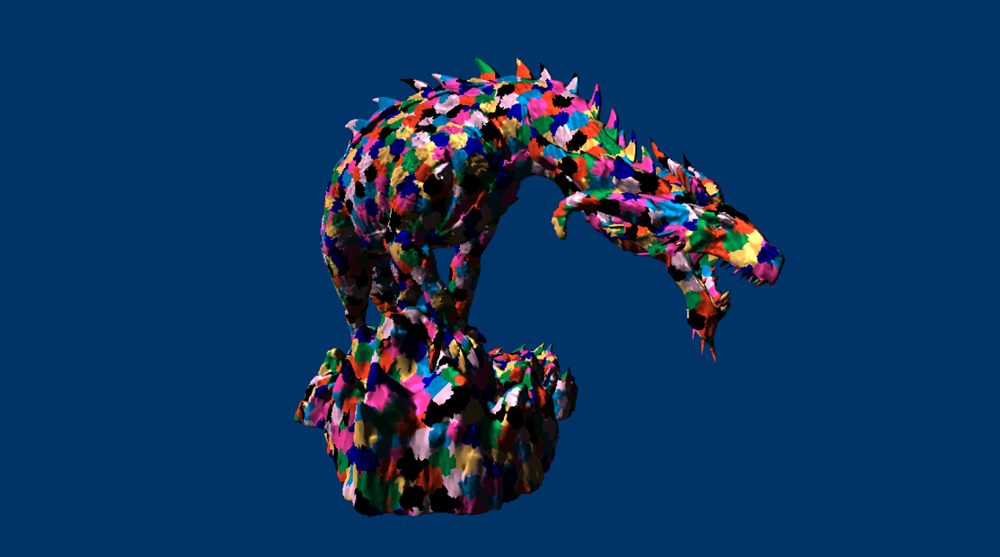

# D3D12 Mesh Shader Samples
This collection of projects act as an introduction to meshlets and rendering with DirectX Mesh Shaders. 

### Getting Started
* DirectX Mesh Shader spec/documentation is available at [DirectX Mesh Shader Specs](https://microsoft.github.io/DirectX-Specs/d3d/MeshShader.html) site.

# Projects
## 1. Meshlet Generator Library
This project is intended to provide a lightweight interface for generating meshlets from streams of position and index data.

## 2. Wavefront Converter Command Line Tool
This project acts as an example of how to integrate the meshlet generator library into a complete mesh conversion application. it provides a basic command line interface for loading obj files using the [tinyobjloader](https://github.com/tinyobjloader/tinyobjloader) library, processing the mesh with the [DirectXMesh](https://github.com/microsoft/DirectXMesh) library, and exporting to a simple binary model file format.

## 3. Meshlet Viewer
This sample demonstrates the basics of how to render a meshletized model with DirectX 12. This app loads the models exported by the Wavefront Converter Tool, providing the full picture of generating & rendering meshlets. 

## Requirements
* [Visual Studio 2019](https://www.visualstudio.com/).
* [Windows SDK Insider Preview](https://www.microsoft.com/en-us/software-download/windowsinsiderpreviewSDK).
  * Windows 10 Insider Preview
  * Windows SDK 19041
  * DirectX 12 GPU with compatible drivers (NVIDIA RTX GPU driver version >= 450.56)

## Further resources
* [DirectX Mesh Shader Spec](https://microsoft.github.io/DirectX-Specs/d3d/MeshShader.html)
* [NVIDIA Mesh Shader Blog](https://devblogs.nvidia.com/introduction-turing-mesh-shaders/)

## Feedback and Questions
We welcome all feedback, questions and discussions about the mesh shader pipeline on our [discord server](http://discord.gg/directx).
