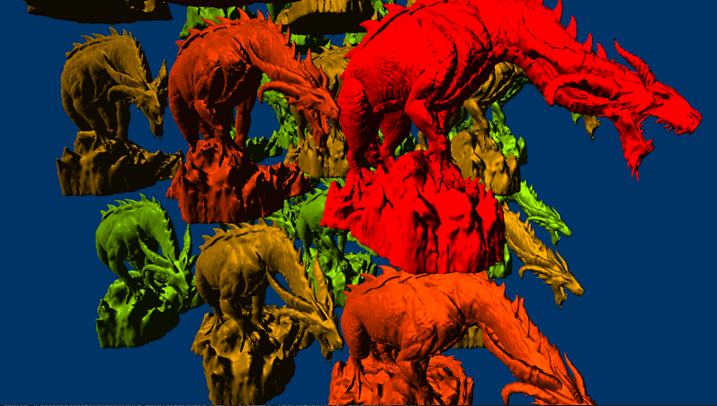
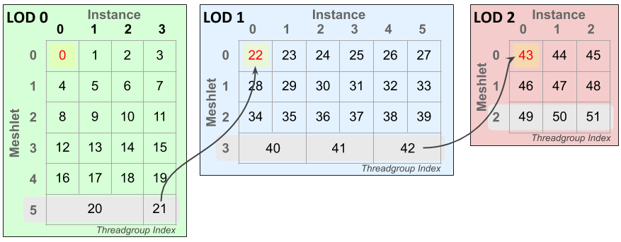
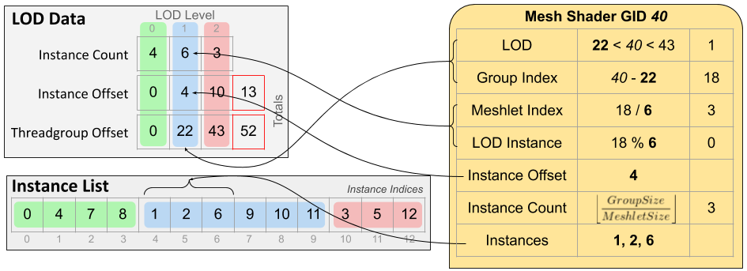

# D3D12 Dynamic LOD Sample

## Description
This sample demonstrates how to leverage amplification shaders to do per-instance frustum culling and mesh level-of-detail (LOD) selection entirely on the GPU for an arbitrary number of instances. Using the mesh shader pipeline this technique fits neatly into a single amplification & mesh shader pipeline state object.

There are three visualization modes included:
1. Flat - Basic phong shading with a white diffuse color
2. Meshlets - Visualizes meshlets by giving each meshlet a distinct color
3. LOD - Colors the mesh based on the currently selected level of detail (red - most detailed, green - least detailed)

---
## Controls
|  |  |
|---|---|
| ASWD | Translate Camera |
| Arrows | Rotate Camera |
| Space | Change Visualization Mode |
| + | Increase Instance Level |
| - | Decrease Instance Level |

---
## Implementation Notes
The amplification shader stage precedes the mesh shader stage in the mesh shader pipeline. It’s a compute-like shader stage whose purpose is to determine the outstanding geometric workload, populate a payload buffer of data, and launch the requisite number of mesh shader threadgroups to process geometry.

CPU-side code generates instances by user input and uploads the instance buffer to a GPU resource. An array of mesh LODs populate a descriptor table for shader code to dynamically index into by LOD index. The amplification shader (AS) is configured to have a group size of one shader wave – this avoids the necessity of wave synchronization and memory barriers. The CPU dispatches enough AS waves to schedule one instance per thread.

Each thread of the AS threadgroup processes a single instance - culling against the view frustum and doing an LOD calculation. LOD instance counts are taken and reorganized using wave intrinsics to generate payload data for the dispatched mesh shaders (Figure 2, left). This consists of a few different per-LOD instance counts, offsets, and instance index lists. The total number of meshlets to render determines the number of mesh shader threadgroups to dispatch using the DispatchMesh amplification shader intrinsic function.

*Figure 1: Example indexing layout of mesh shader threadgroups across instances and meshlets. In this scenario four instances are LOD 0, six instances LOD 1, and three instances LOD 2 requiring 52 mesh shader threadgroups. The last meshlet of each LOD (highlighted gray) may pack multiple instances into a single mesh shader threadgroup – its vertex & primitive count allowing. The yellow highlighted cells are the first threadgroup for each LOD, the red value is the global offset of each LOD level – this must be subtracted off the threadgroup index to determine the threadgroup’s LOD index. Arrows are to show continuation of threadgroup IDs across LOD boundaries.*

*Figure 2: The payload data (left) passed from each Amplification Shader threadgroup to its dispatched Mesh Shader threadgroups (example threadgroup on right.) Using the threadgroups index the shader can compute the LOD, meshlet, and instance indices for which it should process. Group size is the number of threads in a threadgroup, and meshlet size is the max of a meshlet’s vertex and primitive count.*

The mesh shader is a simple meshlet rendering shader, but with code to compute its LOD, meshlet, and instance indices using the payload data. Meshlet and vertex data is read by indexing into SRV arrays by LOD index. Multiple instances may be processed in a single threadgroup if it’s the last meshlet of an LOD level to maximum threadgroup utilization.