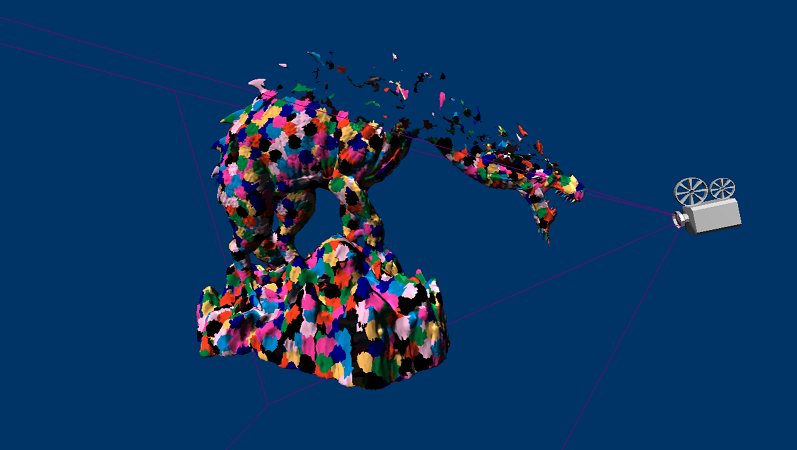

# D3D12 Meshlet Culling Sample

## Description
Amplification shaders are an optional stage preceding the mesh shader stage in the Mesh Shader Pipeline. Its purpose is to determine the required number of mesh shader threadgroups necessary in a specific GPU task, optionally passing a payload of data to its dispatched MS child threadgroups. This can be used to reduce or expand workloads before they reach the mesh shader stage in the pipeline.

This sample demonstrates how to leverage amplification shaders to cull meshlets against the camera using per-meshlet culling metadata. The goal is to minimize the number of mesh shader threadgroups required to only those portions that are deemed potentially visible before they’re ever launched.

There are a couple render modes provided by the sample: flat shading and a meshlet visualization. Within the meshlet view mode you can pick a meshlet from the scene to visualize its bounding sphere and a cone which represents the breadth of normals within the meshlet. No cone is rendered if that meshlet’s cone of normals forms a degenerate cone (wider than a hemisphere.)

---
## Controls
|  |  |
|---|---|
| ASWD | Translate Camera |
| Arrow Keys | Rotate Camera |
| Shift + ASWD | Translate Debug Camera |
| Shift + Arrow Keys | Rotate Debug Camera |
| Space | Toggle Meshlet Drawing |
| Mouseover | Highlight Meshlet for Selection |
| Tab | Select Highlighted Meshlet |

---
## Implementation Notes
This technique starts with the generation of culling data at meshlet generation time. After the meshlet list is complete each meshlet’s object space bounding sphere and normal cone is computed. This data is then compressed through quantization to save memory on-disk and read bandwidth.

A normal cone represents the spread of the normals within a meshlet – a cone enveloping all the normals of its primitives. It’s stored as a 4-tuple of normalized float values – a 3D unit vector representing the average normal direction and a scalar representing the dot product between that vector and the most divergent triangle normal.

For the benefit of the culling test the actual stored value is -cos(maximal angle + 90º). 90º are added since a triangle is observable over an entire hemisphere (or 90º about its normal) and negated as the inverted cone encompasses the set of view directions from which this surface normal would be backfacing. This reduces the culling test to a single dot product and floating-point comparison.

The amplification shader is structured to process a single meshlet on each thread. Thus, to render a mesh composed of n meshlets, ⌈n / GroupSize⌉ threadgroups must be dispatched. A threadgroup size equal to the platform’s wave size is chosen to facilitate the use of wave intrinsics for threadgroup-wide operations. Each thread is responsible for performing view frustum and normal cone culling tests against its meshlet (indexed by its dispatch thread ID). Using the prefix sum wave intrinsic the indices of visible meshlets are compacted into a groupshared memory lookup table for the launched mesh shader threadgroups. The shader ends with a call to the amplification shader intrinsic function DispatchMesh to launch the requisite number of mesh shader threadgroups and specify the groupshared lookup table as payload data.
