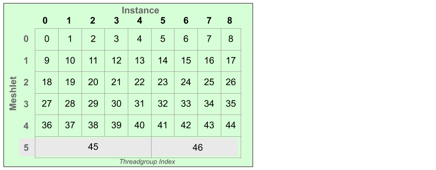

# D3D12 Meshlet Instancing Sample

## Description
Instancing as an API concept was introduced to the legacy graphics pipeline at the dawn of DirectX 10 back in February 2007. However, the instancing functionality available in the legacy pipeline requires the use of hardware components the mesh shader pipeline intentionally foregos. These components are encapsulated as the Input Assembler stage in the D3D12 legacy graphics pipeline, processing the index buffer, de-duplicating vertex indices, generating instance IDs, packing threadgroups, etc. The purpose of this omission is to reduce reliance on specific hardware components which may become a bottleneck to pipeline throughput, while also providing as generic functionality as possible for developers.

This means implementing a version of this functionality is up to application code. The structure of meshlets are already a great start in realizing bits of this functionality in software and data structure. Each meshlet has a fixed maximum size which makes them easily mappable to fixed-sized threadgroups. Their primitive indices are pre-de-duplicated within each meshlet to avoid transforming the same vertex multiple times unnecessarily. 

Instancing, however, is a feature that requires more logic on top of using meshlets. The application code must launch the correct number of threadgroups to facilitate the desired instance count. Shader code must calculate the correct instance index using its group & thread IDs to find the appropriate instance data. These aren't difficult to implement but requires some forethought and understanding of how threadgroups operate to get right.

This sample demonstrates the aforementioned techniques as well as tackling another issue which can arise - poor thread utilization. Ideally all meshlets composing a mesh are full - a vertex and/or primitive count which reaches the meshlet's pre-defined maximum size. This guarantees each threadgroup can process a single meshlet and utilize all its threads. If meshlets are consistently under-filled then each threadgroup wastes threads, which will require more threadgroups to render the same number of primitives.

Even assuming the meshlet builder ensures full meshlets it can't be guaranteed at the end of a mesh. The builder will eventually exhaust the primitive list while assembling the final meshlet. The last meshlet could find itself with significantly less vertices and primitives than the maximum amount, wasting many threads for every rendered instance. It becomes an egregious issue for very small meshes (in the range of 1 to 4 meshlets) where the proportion of one meshlet to the entire mesh is significant. This leads to a technique demonstrated here of packing multiple instances of the last meshlet into a single threadgroup to maintain maximal threadgroup utilization across all instances.

---
## Controls
|  |  |
|---|---|
| ASWD | Translate Camera |
| Arrows | Rotate Camera |
| + | Increase Instance Level |
| - | Decrease Instance Level |

---
## Implementation Notes
The application code generates a parameterized scene of instances. A buffer stuffed with instance transform data is uploaded to the GPU as usual. At the time of command list recording the number of threadgroups necessary to accomodate the current instance count is computed.

This implementation assumes the first *(MeshletCount - 1)* meshlets of each subset are ideally filled, so one threadgroup per meshlet is necessary. 

Multiple instances of the final meshlet are packed into a single threadgroup. The number of instances we can pack into one threadgroup is based on the final meshlet's vertex/primitive count and the maximum number of vertices/primitives which may be submitted by a threadgroup. This is declared in the mesh shader function signature as the length of the *vertices* and *indices* output arrays, respectively. Using these values the number of instances which can be packed into a single threadgroup can be computed.

*Figure 1: Visual representation of the layout of mesh shader threadgroups and the associated meshlet and instance IDs which they'll process. Notice that multiple instances of the final meshlet are packed into the last two threadgroups. This implies that at most five instances of the final meshlet can be packed into a single threadgroup.*

The total number of threadgroups is then easily calculable. The application also breaks up the DispatchMesh(...) calls into batches of a maximum of 65536 threadgroups to restrain the dispatch dimensions to 1D. 

After which it's up to shader code to use its ID to determine its meshlet & instance indices. For unpacked meshlets the calculation is trivial &ndash; 

- MeshletIndex = GroupId / InstanceCount
- InstanceIndex = GroupId % InstanceCount

For packed meshlets we need more a few more calculations. Luckily determining whether this instance will be packed is very easy with the meshlet index. Then we compute the threadgroup's starting instance and instance count. This allows us to calculate the final vertex & primitive counts. Note that any given thread may operate on a different instance during the vertex and primitive phases since the meshlet will likely have different numbers of vertices and primitives.