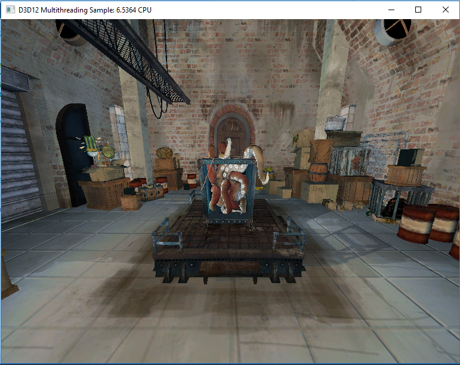

# Multithreading Sample

This sample demonstrates the use of multiple threads with Direct3D 12. An app can use multithreading to improve efficiency by building command lists on multiple threads asynchronously. The majority of the CPU cost is associated with command list building, not command list execution. Apps must ensure they never concurrently call methods on the same command list or command allocator.

### Optional Features
This sample has been updated to build against the Windows 10 Anniversary Update SDK. In this SDK a new revision of Root Signatures is available for Direct3D 12 apps to use. Root Signature 1.1 allows for apps to declare when descriptors in a descriptor heap won't change or the data descriptors point to won't change.  This allows the option for drivers to make optimizations that might be possible knowing that something (like a descriptor or the memory it points to) is static for some period of time.