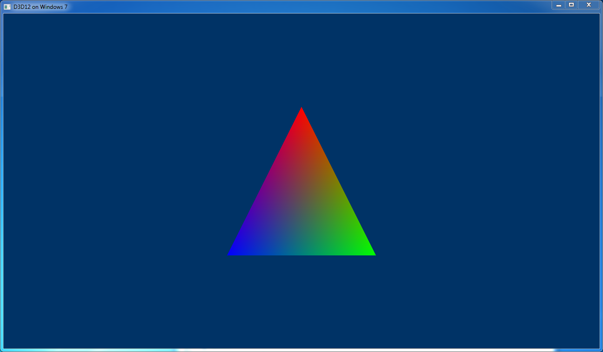

# D3D12On7 Sample

This sample showcases how to use D3D12 on Windows 7, aka D3D12On7. Specifically, this sample demonstrates how to write an app that supports running with D3D12 both on Windows 7 and 10 with the same packaging layout and executable.

D3D12 on Windows 7 is quite different to D3D12 on Windows 10. To use D3D12 on Windows 10, all you need to do is link to D3D12.lib and you're on your way. But D3D12 doesn't exist on Windows 7 in such a way that you can do that. Instead, apps that want to use D3D12 on Windows 7 need to redistribute the D3D12.dll file, along with supporting binaries. Then, at runtime, you'll need to be explicit about which D3D12.dll you are going to use, either the one bundled with your app, or the one that comes from the OS.

On top of the different distribution model, there is a set of APIs which do not work the same way, either because they come from other binaries in the operating system that were updated in Windows 10 to support D3D12, or because they rely on functionality in the Windows kernel that was added in Windows 10. The big one that every app will need to know about is Present().

For this sample, once the code has been built, you'll also need to grab the D3D12On7 NuGet package from nuget.org, add d3d12.dll into a 12on7 subfolder next the exe, and put dxilconv7.dll next the exe. Then the sample will work on Windows 7.

For more details on D3D12 on Windows 7, see http://aka.ms/d3d12on7.
