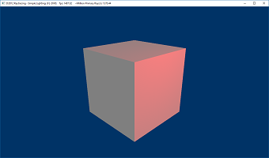
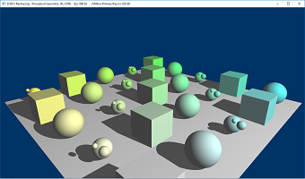
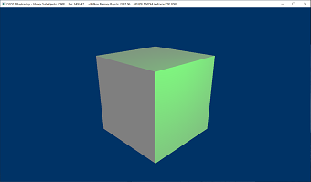

# D3D12 Raytracing Samples
This collection of samples act as an introduction to DirectX Raytracing (DXR). The samples are divided into tutorials and advanced samples. Each tutorial sample introduces a few new DXR concepts. Advanced samples demonstrate more complex techniques and applications of raytracing.

### Getting Started
* DXR spec/documentation is available at [DirectX Specs site](https://microsoft.github.io/DirectX-Specs/d3d/Raytracing.html).

# Tutorial Samples
## 1. [Hello World Sample](src/D3D12RaytracingHelloWorld/readme.md)
This sample demonstrates how to setup a raytracing pipeline and render a triangle in screen space.

## 2. [Simple Lighting Sample](src/D3D12RaytracingSimpleLighting/readme.md)
This sample demonstrates how to do ray generation for a dynamic perspective camera and calculate simple diffuse shading for a cube from a dynamic point light. 

## 3. [Procedural Geometry Sample](src/D3D12RaytracingProceduralGeometry/readme.md)
This sample demonstrates how to implement procedural geometry using intersection shaders and shows usage of more complex shader table layouts and multiple ray types. 

## 4. [Library Subobjects Sample](src/D3D12RaytracingLibrarySubobjects/readme.md)
This sample modifies the Simple Lighting sample, and illustrates how to use library subobjects.

# Advanced Samples
## [MiniEngine Sample](src/D3D12RaytracingMiniEngineSample/readme.md)
This sample demonstrates integration of the DirectX Raytracing in the MiniEngine's Model Viewer and several sample uses of raytracing.

## Requirements
* [Visual Studio 2019](https://www.visualstudio.com/).
* [Windows 10 May 2019 (18362) SDK](https://developer.microsoft.com/en-US/windows/downloads/windows-10-sdk).
  * Windows 10 with the May 2019 update. 
  * Dx12 GPU with a compatible DirectX Raytracing driver.
    * Nvidia: driver version 415 or higher.
    * Other vendors - please consult the vendor you’re working with for HW and driver availability.

## Further resources
* [Nvidia's DXR samples Github](https://github.com/NVIDIAGameWorks/DxrTutorials)

## Feedback and Questions
We welcome all feedback, questions and discussions about DXR on our [discord server](http://discord.gg/directx).
