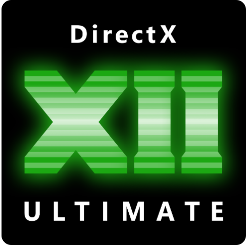
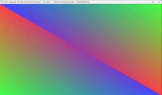
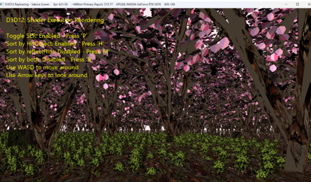
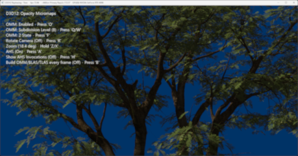
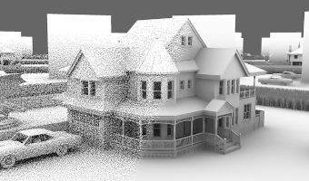

# Direct3D 12 raytracing samples
This collection of samples act as an introduction to DirectX Raytracing (DXR). The samples are divided into tutorials and advanced samples. Each tutorial sample introduces a few new DXR concepts. Advanced samples demonstrate more complex techniques and applications of raytracing.

### Requirements
* GPU and driver with support for [DirectX 12 Ultimate](http://aka.ms/DirectX12UltimateDev)

  

### Getting Started
* DXR spec/documentation is available at [DirectX Specs site](https://microsoft.github.io/DirectX-Specs/d3d/Raytracing.html).

# Known issues
Depending on your Visual Studio version, some samples may fail to compile with these errors:
 * The system cannot find the path specified. *.hlsl.h
 * error MSB6006: "dxc.exe" exited with code 1.

Please see this GitHub issue for details on how to fix it: https://github.com/microsoft/DirectX-Graphics-Samples/issues/657

# Tutorial Samples
## 1. [Hello World Sample](src/D3D12RaytracingHelloWorld/readme.md)
This sample demonstrates how to setup a raytracing pipeline and render a triangle in screen space.

## 2. [Simple Lighting Sample](src/D3D12RaytracingSimpleLighting/readme.md)
This sample demonstrates how to do ray generation for a dynamic perspective camera and calculate simple diffuse shading for a cube from a dynamic point light. 

## 3. [Procedural Geometry Sample](src/D3D12RaytracingProceduralGeometry/readme.md)
This sample demonstrates how to implement procedural geometry using intersection shaders and shows usage of more complex shader table layouts and multiple ray types. 

## 4. [Library Subobjects Sample](src/D3D12RaytracingLibrarySubobjects/readme.md)
This sample modifies the Simple Lighting sample, and illustrates how to use library subobjects.

## 5. [Hello Shader Execution Reordering Sample](src/D3D12RaytracingShaderExecutionReordering/readme.md)
This sample modifies the Hello World sample, illustrating Shader Execution Reordering in a minimalist way.

## 6. [Sakura Forest - Shader Execution Reordering Sample](src/D3D12RaytracingSakuraForestSER/readme.md)
This sample demonstrates Shader Execution Reordering (SER) in a more complex sakura forest scene. It shows how to use SER to give hints to the GPU for grouping threads based on hit group behaviour (HitObject), material coherence (e.g. reflectHint), or both to improve execution efficiency.

## 7. [Opacity Micromaps Sample](src/D3D12RaytracingOpacityMicromaps/readme.md)
This sample demonstrates how to use Opacity Micromaps with a tree model.

# Advanced Samples
## [Real-Time Denoised Ambient Occlusion](src/D3D12RaytracingRealTimeDenoisedAmbientOcclusion/readme.md)
This sample implements a real-time denoiser for 1spp raytraced Ambient Occlusion. It also demonstrates a physically-based specular pathtracer implementation and dynamic geometry support.

## [MiniEngine Sample](src/D3D12RaytracingMiniEngineSample/readme.md)
This sample demonstrates integration of the DirectX Raytracing in the MiniEngine's Model Viewer and several sample uses of raytracing.

## Further resources
* [Nvidia's DXR samples Github](https://github.com/NVIDIAGameWorks/DxrTutorials)

## Feedback and Questions
We welcome all feedback, questions and discussions about DXR on our [discord server](http://discord.gg/directx).
