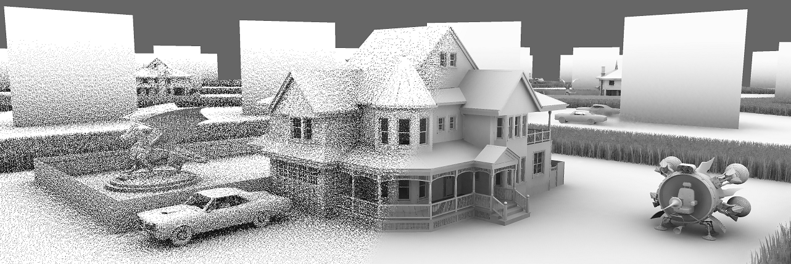

# D3D12 Raytracing Ambient Occlusion sample

This sample demonstrates how to implement Ambient Occlusion. The sample assumes familiarity with Dx12 programming and DirectX Raytracing concepts introduced in the [D3D12 Raytracing Procedural Geometry sample](../D3D12RaytracingDProceduralGeometry/readme.md).

ToDo...

## Usage
ToDo

D3D12RaytracingAmbientOcclusion.exe [...]
  * [-forceAdapter \<ID>] - create a D3D12 device on an adapter <ID>. Defaults to adapter 0.

### UI
The title bar of the sample provides runtime information:
* Name of the sample
* Frames per second
* Million Primary Rays/s: a number of dispatched rays per second calculated based of FPS.
* GPU[ID]: name

### Controls
* ALT+ENTER - toggles between windowed and fullscreen modes.
* L - enable/disable light animation.
* C - enable/disable camera animation.
* ESC - terminate the application.
* Hold left mouse key and drag - rotate camera's focus at position.
* Hold right mouse key and drag - rotate scene.
* 
## Requirements
* Requires DXR capable HW and SW. Consult the main [D3D12 Raytracing readme](../../readme.md) for requirements. The sample doesn't implement Raytracing Fallback Layer path.