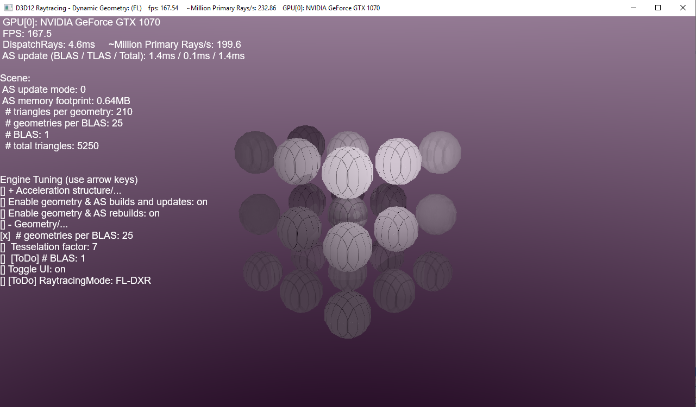

# D3D12 Raytracing Dynamic Geometry sample

This sample demonstrates how to implement dynamic geometry. The sample assumes familiarity with Dx12 programming and DirectX Raytracing concepts introduced in the [D3D12 Raytracing Procedural Geometry sample](../D3D12RaytracingProceduralGeometry/readme.md).

ToDo...

## Usage
The sample starts with Raytracing Fallback Layer API implementation being used by default. The Fallback Layer will use raytracing driver if available, otherwise it will default to the compute fallback. This default behavior can be overriden via UI controls or input arguments.

D3D12RaytracingDynamicGeometry.exe [ -FL | -DXR | ...]
* [-FL] - select Fallback Layer API with forced compute fallback path.
* [-DXR] - select DirectX Raytracing API.

Additional arguments:
  * [-forceAdapter \<ID>] - create a D3D12 device on an adapter <ID>. Defaults to adapter 0.

### UI
The title bar of the sample provides runtime information:
* Name of the sample
* Raytracing API being active:
  * FL - Fallback Layer with compute fallback being used
  * FL-DXR - Fallback Layer with raytracing driver being used
  * DXR - DirectX Raytracing being used
* Frames per second
* Million Primary Rays/s: a number of dispatched rays per second calculated based of FPS.
* GPU[ID]: name

### Controls
* ALT+ENTER - toggles between windowed and fullscreen modes.
* 1 - select Fallback Layer API.
* 2 - select Fallback Layer API with forced compute fallback path.
* 3 - select DirectX Raytracing API.
* L - enable/disable light animation.
* C - enable/disable camera animation.

## Requirements
* Consult the main [D3D12 Raytracing readme](../../readme.md) for requirements.