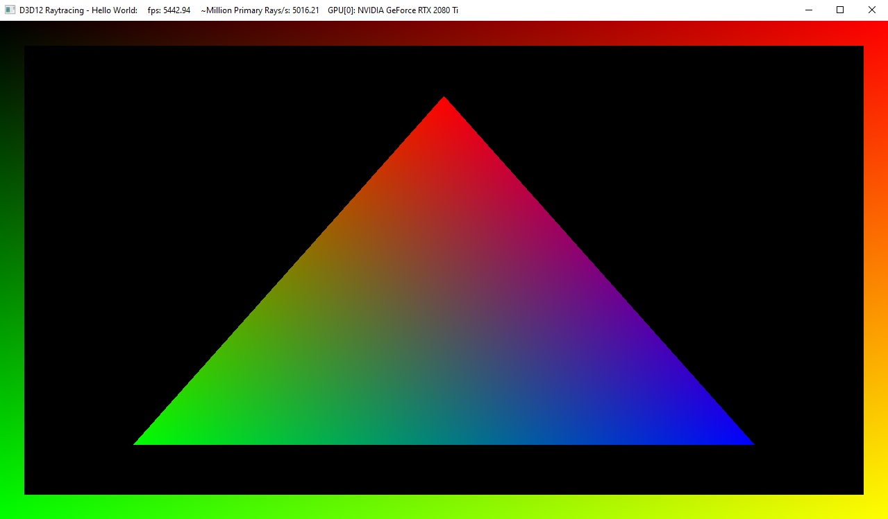

# D3D12 Raytracing Hello World sample

This sample demonstrates how to setup a raytracing pipeline and render a triangle in screenspace via raytracing. The sample assumes familiarity with Dx12 programming.

##### Raytracing Initialization
The initialization of the raytracing pipeline is done in CreateDeviceDependentResources() and includes querying raytracing device and commandlist, creating raytracing acceleration structures, raytracing pipeline state object, shader tables and a 2D texture output resource.

##### Rendering
Each frame render happens in the sample's OnRender() call and includes executing DispatchRays() with a 2D grid dimensions matching that of backbuffer resolution and copying of the raytraced result to the backbuffer before finally presenting the it to the screen. The sample implements three shaders: *ray generation*, *closest hit* and *miss* shader. The ray generation shader is executed for the whole render target via DispatchRays(). If a ray index corresponding to a pixel is inside a stencil window, it casts a ray into the scene. For ray indices outside the stencil window, the shader outputs color based on the ray's xy dispatch coordinates from top-left. Casted rays that hit the triangle render barycentric coordinates of the ray's hit position within the triangle. Missed rays render black.

## Usage
D3D12RaytracingHelloWorld.exe 

Additional arguments:
  * [-forceAdapter \<ID>] - create a D3D12 device on an adapter \<ID>. Defaults to adapter 0.

### UI
The title bar of the sample provides runtime information:
* Name of the sample
* Frames per second
* Million Primary Rays/s: a number of dispatched rays per second calculated based of FPS.
* GPU[ID]: name

## Requirements
* Windows 10 with the October 2018 update or higher.
* Consult the main [D3D12 Raytracing readme](../../readme.md) for further requirements.