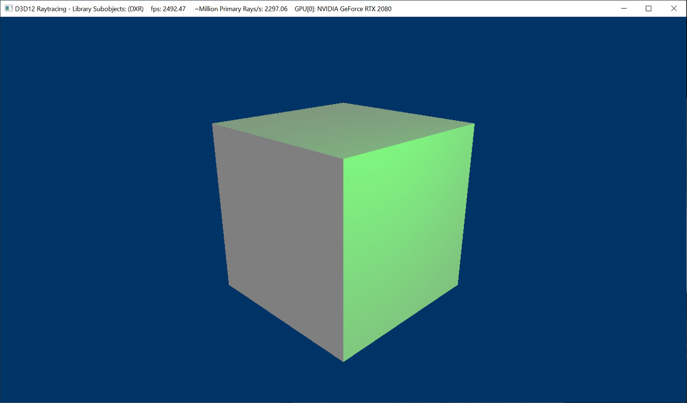

# D3D12 Raytracing Library Subobject Sample


This sample modifies the [D3D12 Raytracing Simple Lighting sample](../D3D12RaytracingSimpleLighting/readme.md) to illustrate how to  define `D3D12_STATE_SUBOBJECTS` in the DXIL library hlsl shader code, and use it in C++ source to create raytracing state objects. This method of specifying subobjects is simpler, modular, and more reusable since both the shader and its properties can be encapsulated within the same shader. 

The sample assumes familiarity with Dx12 programming and DirectX Raytracing concepts introduced in the [D3D12 Raytracing Simple Lighting sample](../D3D12RaytracingSimpleLighting/readme.md).

##### Changes for using library subobjects
* The D3D12 Raytracing Simple Lighting sample used implicit default subobjects (except for local root signature) at state object scope. All the suboject except for the DXIL library can be removed, and moved inside the library (can be made into library subobjects). As all the shaders are within the same DXIL library, existing implicit default subobject will apply to all the shader at this library scope. 

* Thus library subobjects (including local root signature association) can be defined in the `Raytracing.hlsl` file using  compiler instrinsics as follows:
```cpp
GlobalRootSignature MyGlobalRootSignature =
  {
    "DescriptorTable( UAV( u0 ) ),"                        // Output texture
    "SRV( t0 ),"                                           // Acceleration structure
    "CBV( b0 ),"                                           // Scene constants
    "DescriptorTable( SRV( t1, numDescriptors = 2 ) )"     // Static index and vertex buffers.
  };

LocalRootSignature MyLocalRootSignature = 
{
    "RootConstants( num32BitConstants = 4, b1 )"           // Cube constants        
};

TriangleHitGroup MyHitGroup =
{
    "",                     // AnyHit
    "MyClosestHitShader",   // ClosestHit
};

SubobjectToExportsAssociation  MyLocalRootSignatureAssociation =
{
    "MyLocalRootSignature",  // subobject name
    "MyHitGroup"             // export association 
};

RaytracingShaderConfig  MyShaderConfig =
{
    16, // max payload size
    8   // max attribute size
};

RaytracingPipelineConfig MyPipelineConfig =
{
    1 // max trace recursion depth
};
```

* Subobject names in the library in the exports are exported from library subobject (without renaming them). Using this all the export subobjects are processed and associations are resolved during the DXIL library in `CreateStateObject` call. This exporting is done in `D3D12RaytracingLibrarySubobjects.cpp` as follows:
```
  // Library subobject names
  const wchar_t* D3D12RaytracingLibrarySubobjects::c_globalRootSignatureName = L"MyGlobalRootSignature";
  const wchar_t* D3D12RaytracingLibrarySubobjects::c_localRootSignatureName =  L"MyLocalRootSignature";
  const wchar_t* D3D12RaytracingLibrarySubobjects::c_localRootSignatureAssociationName = L"MyLocalRootSignatureAssociation";
  const wchar_t* D3D12RaytracingLibrarySubobjects::c_shaderConfigName = L"MyShaderConfig";
  const wchar_t* D3D12RaytracingLibrarySubobjects::c_pipelineConfigName = L"MyPipelineConfig";

{
  lib->DefineExport(c_globalRootSignatureName);
  lib->DefineExport(c_localRootSignatureName);
  lib->DefineExport(c_localRootSignatureAssociationName);
  lib->DefineExport(c_shaderConfigName);
  lib->DefineExport(c_pipelineConfigName);
  lib->DefineExport(c_hitGroupName);
}
```

* Used `CreateRootSignature` API to create global root signature directly from the DXIL library as following:
```cpp
  // A unique global root signature is defined in hlsl library g_pRaytracing. For such scenario we can create 
  // compute root signature can directly from the library bytecode, using CreateRootSignature API. 
  ThrowIfFailed(device->CreateRootSignature(1, g_pRaytracing, ARRAYSIZE(g_pRaytracing), IID_PPV_ARGS(&m_raytracingGlobalRootSignature)));
```


## Usage
D3D12RaytracingLibrarySuobjects.exe

Additional arguments:
  * [-forceAdapter \<ID>] - create a D3D12 device on an adapter \<ID>. Defaults to adapter 0.


### UI
The title bar of the sample provides runtime information:
* Name of the sample
* Frames per second
* Million Primary Rays/s: a number of dispatched rays per second calculated based of FPS.
* GPU[ID]: name

## Requirements
* Windows 10 with the May 2019 update or higher.
* Consult the main [D3D12 Raytracing readme](../../readme.md) for further requirements.