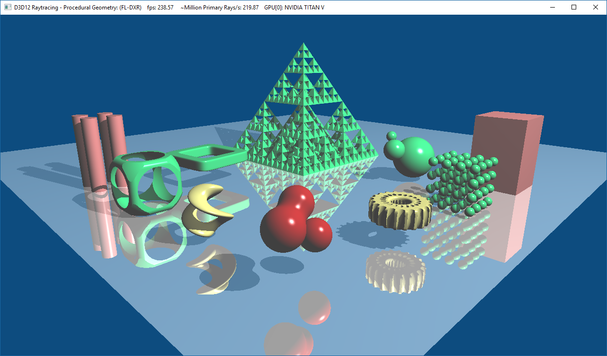

# D3D12 Raytracing Procedural Geometry sample
[](https://www.youtube.com/watch?v=GwAagGuwJRI "D3D12 Raytracing Procedural Geometry")
[YouTube video preview of the sample](https://www.youtube.com/watch?v=GwAagGuwJRI)


This sample demonstrates how to implement procedural geometry using intersection shaders. It utilizes multiple intersections shaders to create analytic and volumetric, signed distance and fractal geometry. In addition, it introduces:
* Extended shader table layouts and indexing covering multiple geometries and bottom-level acceleration structures (bottom-level AS, or BLAS for short).
* Use of trace ray recursion and two different ray types: radiance and shadow rays.

The sample assumes familiarity with Dx12 programming and DirectX Raytracing concepts introduced in the [D3D12 Raytracing Simple Lighting sample](../D3D12RaytracingSimpleLighting/readme.md).

### Scene
The scene consists of triangle and procedural geometry. Specifically, the geometry in the scene is:
* **Triangle geometry** - a ground plane quad.
* **Procedural geometry** - all the objects above the ground plane.

Since mixing triangle and procedural geometry types is not supported within a single bottom-level AS, both triangle and procedural geometry are stored in separate bottom-level AS. 

#### Procedural geometry
Procedural geometry is defined by an axis-aligned bounding box (AABB) and an intersection shader. The AABB defines geometric confines within a bottom-level AS object space. When a ray hits the AABB, an associated intersection shader for the AABB from the hit group is called to evaluate if the ray intersects any geometry within it. If the shader finds an intersection, it calls *ReportHit()*. 

This sample implements three intersection shaders with multiple different primitives per each intersection shader:
  * **Analytic geometry** - a geometry with multiple spheres and an axis aligned box.
  * **Volumetric geometry** - a metaballs isosurface (aka "blobs").
  * **Signed distance geometry** - six different primitives and a fractal pyramid.

The ray/procedural primitive tests used in the intersection shaders assume primitive local space with AABB implicitly being <-1,1>. The sample applies per primitive scale transform to scale up the AABBs. A ray can only be retrieved either in world space (via *WorldRay\*()* intrinsic) or bottom-level AS object space (via *ObjectRay\*()* intrinsic). Therefore, the application passes transforms for converting between bottom-level AS object and primitive local space and vice versa to the intersection shader. When an intersection shader is called, it first transforms an object space ray into local space and, then, calls one of the ray/primitive intersection tests such as *RayAnalyticGeometryIntersectionTest* in the following *MyIntersectionShader_AnalyticPrimitive* intersection shader: 
```c
// Get ray in AABB's local space.
Ray GetRayInAABBPrimitiveLocalSpace()
{
    PrimitiveInstancePerFrameBuffer attr = g_AABBPrimitiveAttributes[l_aabbCB.instanceIndex];
    
    // Retrieve a ray origin position and direction in bottom level AS space 
    // and transform them into the AABB primitive's local space.
    Ray ray;
    ray.origin = mul(float4(ObjectRayOrigin(), 1), attr.bottomLevelASToLocalSpace).xyz;
    ray.direction = mul(ObjectRayDirection(), (float3x3) attr.bottomLevelASToLocalSpace);
    return ray;
}

[shader("intersection")]
void MyIntersectionShader_AnalyticPrimitive()
{
    Ray localRay = GetRayInAABBPrimitiveLocalSpace();
    AnalyticPrimitive::Enum primitiveType = (AnalyticPrimitive::Enum) l_aabbCB.primitiveType;

    float thit;
    ProceduralPrimitiveAttributes attr;
    if (RayAnalyticGeometryIntersectionTest(localRay, primitiveType, thit, attr))
    ...
```


If the ray intersects the geometry, the test returns true with the time of the hit as well as a corresponding surface normal in the local space. The shader then needs to transform the normal to world space and pass it to *ReportHit()*, which either accepts or rejects the hit.
```c
    ...
    if (RayAnalyticGeometryIntersectionTest(localRay, primitiveType, thit, attr))
    {
        PrimitiveInstancePerFrameBuffer aabbAttribute = g_AABBPrimitiveAttributes[l_aabbCB.instanceIndex];
        attr.normal = mul(attr.normal, (float3x3) aabbAttribute.localSpaceToBottomLevelAS);
        attr.normal = normalize(mul((float3x3) ObjectToWorld3x4(), attr.normal));

        ReportHit(thit, /*hitKind*/ 0, attr);
    }
}
```
To increase efficiency, ray intersection tests in the sample validate each ray hit against the valid global time range as well as the *RayFlags()*, instead of immediately returning and depending on ReportHit() to confirm a hit and redo all the setup math. This also lets the sample not require any hit shaders to evaluate the hits after ReportHit() is called.
```c
// Test if a hit is culled based on specified RayFlags.
bool IsCulled(in Ray ray, in float3 hitSurfaceNormal)
{
    float rayDirectionNormalDot = dot(ray.direction, hitSurfaceNormal);

    bool isCulled = 
        ((RayFlags() & RAY_FLAG_CULL_BACK_FACING_TRIANGLES) && (rayDirectionNormalDot > 0))
        ||
        ((RayFlags() & RAY_FLAG_CULL_FRONT_FACING_TRIANGLES) && (rayDirectionNormalDot < 0));

    return isCulled; 
}

// Test if a hit is valid based on specified RayFlags and <RayTMin, RayTCurrent> range.
bool IsAValidHit(in Ray ray, in float thit, in float3 hitSurfaceNormal)
{
    return IsInRange(thit, RayTMin(), RayTCurrent()) && !IsCulled(ray, hitSurfaceNormal);
}
```

##### Procedural geometry types
This sample demonstrates intersection tests for a ray vs following procedural geometry:

***Analytic geometry*** including multiple spheres and an AABB.

***Volumetric geometry*** that implements metaballs. Metaballs are an isosurface within a potential field that is formed from point sources. Each source has an area of influence and the field is defined with a potential polynomial function that smoothly decreases with distance from the source's center. If there are multiple field sources, their contributing potential values are summed. The isosurface is defined via an application specified threshold value. To find the hit point on the isosurface, the intersection test ray marches through the field within the AABB, calculating the total field potential at each iteration, until it hits the threshold or it exits the AABB. See more detailed explanation of the algorithm at [https://www.scratchapixel.com/lessons/advanced-rendering/rendering-distance-fields/blobbies](https://www.scratchapixel.com/lessons/advanced-rendering/rendering-distance-fields/blobbies)

***Signed distance geometry*** is geometry defined with signed distance functions. Each function returns a closest distance to the geometry considering all directions from a specific position. Since the distance is not necessarily the one that of along the ray direction, the intersection test needs to iteratively ray march and calculate signed distances at each step until it gets close enough to the surface. This algorithm is called sphere tracing and it converges to a solution faster than a constant ray stepping algorithm. See more at [https://www.scratchapixel.com/lessons/advanced-rendering/rendering-distance-fields/basic-sphere-tracer](https://www.scratchapixel.com/lessons/advanced-rendering/rendering-distance-fields/basic-sphere-tracer). A nice property of signed distance functions is that they support different logical operators and transformations allowing to combine simpler primitives into more complex geometry. This is explained in more detail at [http://www.iquilezles.org/www/articles/distfunctions/distfunctions.htm](http://www.iquilezles.org/www/articles/distfunctions/distfunctions.htm).

##### Geometry updates
 Procedural geometry can be animated or modified without requiring acceleration structure updates as long as the AABBs don't change. The sample animates some of the geometry in the scene this way. It simply updates the transforms passed into shaders with updated rotation transforms every frame. In the metaballs case. it also passes application time to animate field source positions within the metaballs' AABB.

#### Ray types
The sample utilizes two ray types for raytracing: a *radiance* and a *shadow ray*. The difference between the two is RayFlags() definition and what hit group and miss shaders to execute.

***Radiance ray*** is used for primary/view and secondary/reflected ray calls of *TraceRay()*, where a ray calculates shading for each geometry hit and aggregates color contribution over multiple bounces from the scene. 

***Shadow ray*** is used for visibility/occlusion testing towards a light source and is simpler since all it does is to return a Boolean value if it hit any or missed all objects. In practice, shadow ray only requires a miss shader and doesn't require any hit and closest hit shaders defined. It can simply be initialized with a ray payload marking a hit and RayFlags() to skip all but a miss shader.
```c
// Initialize shadow ray payload.
// Set the initial value to true since closest and any hit shaders are skipped. 
// Shadow miss shader, if called, will set it to false.
ShadowRayPayload shadowPayload = { true };
TraceRay(g_scene,
    RAY_FLAG_CULL_BACK_FACING_TRIANGLES
    | RAY_FLAG_ACCEPT_FIRST_HIT_AND_END_SEARCH
    | RAY_FLAG_FORCE_OPAQUE             // ~skip any hit shaders
    | RAY_FLAG_SKIP_CLOSEST_HIT_SHADER, // ~skip closest hit shaders,
    ...
```
Then if the ray doesn't hit any geometry, the miss shader updates the hit Boolean value to false.
```c
[shader("miss")]
void MyMissShader_ShadowRay(inout ShadowRayPayload rayPayload)
{
    rayPayload.hit = false;
}
```

#### Shader tables & indexing
When a ray hits geometry or needs to call a miss shader, GPU indexes into the application provided shader tables according to the following shader table addressing calculation:
```
Miss shader table index = 
     MissShaderIndex                                     ~ from shader: TraceRay()

Hit group shader table index = 
     RayContributionToHitGroupIndex                      ~ from shader: TraceRay()  
     + MultiplierForGeometryContributionToHitGroupIndex  ~ from shader: TraceRay()
     * GeometryContributionToHitGroupIndex               ~ system generated index 
                                                           of geometry in BLAS
     + InstanceContributionToHitGroupIndex               ~ from BLAS instance desc
```

 
Since each ray type applies different actions in the shaders, each requires a separate shader record in the shader table. The same applies for separate geometries as well. This sample uses triangle geometry type and three procedural geometry types with differing intersection shaders, each requiring a separate shader record. Furthermore, there are multiple geometry variants per procedural type, each parametrized via attributes that are provided through local root signatures, which in turn again require a separate shader record for each. 

With that said, the sample has following shader table layouts: 

* **Miss shader table** contains two shader records, one for each ray type.
```
Shader table - MissShaderTable
| [0]: MyMissShader                                   ~ Radiance ray
| [1]: MyMissShader_ShadowRay                         ~ Shadow ray
```
* **Hit group shader table** contains shader records for all multiple geometries with two shader records per geometry. Again, one for each ray type. The full shader table is printed out in the debug output by this sample 
and is useful as a reference when setting up the indexing parameters. Here are first few shader records of a hit group shader table as a reference for an indexing example below. First, there are two shader records for the triangular quad plane. After that, the table contains shader records for the procedural geometry.

```
Shader table - HitGroupShaderTable: 
| [0]: MyHitGroup_Triangle                             ~ Triangle geometry in 1st BLAS
| [1]: MyHitGroup_Triangle_ShadowRay
| [2]: MyHitGroup_AABB_AnalyticPrimitive               ~ 1st Analytic AABB geometry in 2nd BLAS
| [3]: MyHitGroup_AABB_AnalyticPrimitive_ShadowRay
| [4]: MyHitGroup_AABB_AnalyticPrimitive               ~ 2nd Analytic AABB geometry in 2nd BLAS
| [5]: MyHitGroup_AABB_AnalyticPrimitive_ShadowRay
| [6]: MyHitGroup_AABB_VolumetricPrimitive             ~ 1st Volumetric AABB geometry in 2nd BLAS  
| [7]: MyHitGroup_AABB_VolumetricPrimitive_ShadowRay
| [8]: MyHitGroup_AABB_SignedDistancePrimitive         ~ 1st Signed distance AABB geometry in 2nd BLAS
| [9]: MyHitGroup_AABB_SignedDistancePrimitive_ShadowRay
..
```
Given the shader table layouts, the shader table indexing parameters are set as follows:
* **MissShaderIndex** is set to 0 for radiance rays, and 1 for shadow rays in TraceRay().
* **RayContributionToHitGroupIndex** is set to 0 and 1, for radiance and shadow 
  rays respectively, since they're stored subsequently in the shader table for each geometry ID.
* **MultiplierForGeometryContributionToHitGroupIndex** is 2, since there are two hit group shader records (one for each ray type) stored one after another per geometry ID.
* **GeometryContributionToHitGroupIndex** is a geometry ID that is system 
  generated for each geometry within a BLAS. This directly maps to GeometryDesc array order passed in by the application, i.e. {0, 1, 2, ...}.
* **InstanceContributionToHitGroupIndex** is an offset in-between BLAS instances.
  Because triangle geometry BLAS is first, it's set to 0 for triangle BLAS. AABB BLAS
  sets the offset to 2 since the triangle BLAS has two shader records for the plane geometry with radiance and shadow ray hit groups.

**Shader table indexing example**
 * A shader calls a TraceRay() for a shadow ray. Given its a shadow ray it sets RayContributionToHitGroupIndex
 to 1 as an offset to index shadow shader records. It sets MultiplierForGeometryContributionToHitGroupIndex
 to 2 because there are two shader records per geometry. 
* The shadow ray hits a second 
 AABB geometry, hence GeometryContributionToHitGroupIndex being 1, in the second BLAS that contains AABB geometries and second BLAS provides InstanceContributionToHitGroupIndex of 2. 
* The shader index into the hit group shader table above will be
 5 and calculated as:
```
  1  // ~ RayContributionToHitGroupIndex                   - from TraceRay()
+ 2  // ~ MultiplierForGeometryContributionToHitGroupIndex - from TraceRay() 
* 1  // ~ GeometryContributionToHitGroupIndex              - from runtime, 2nd geometry => ID:1
+ 2  // ~ InstanceContributionToHitGroupIndex              - from BLAS instance desc
```

## Usage
D3D12RaytracingProceduralGeometry.exe

Additional arguments:
  * [-forceAdapter \<ID>] - create a D3D12 device on an adapter \<ID>. Defaults to adapter 0.

### UI
The title bar of the sample provides runtime information:
* Name of the sample
* Frames per second
* DispatchRays(): a GPU execution time of raytracing DispatchRays call.
* Million Primary Rays/s: a number of dispatched rays per second calculated based of FPS.
* GPU[ID]: name

### Controls
* ALT+ENTER - toggles between windowed and fullscreen modes.
* C - enable/disable camera animation.
* G - enable/disable geometry animation.
* L - enable/disable light animation.

## Requirements
* Windows 10 with the October 2018 update or higher.
* Consult the main [D3D12 Raytracing readme](../../readme.md) for further requirements.