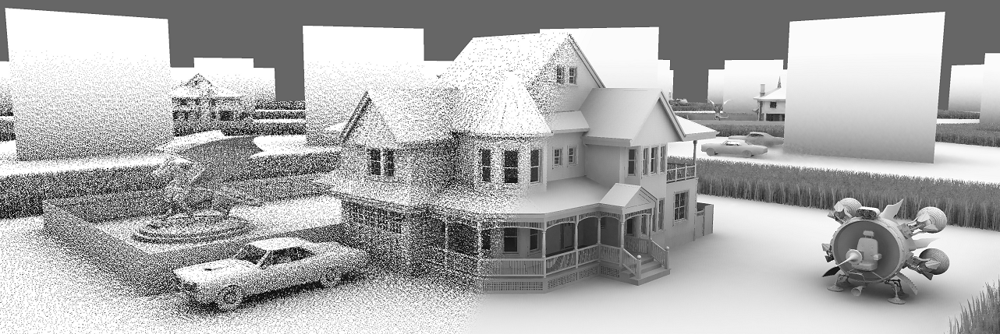

# D3D12 Raytracing Real-Time Denoised Ambient Occlusion sample

**Figure** *A render of raytraced Ambient Occlusion via our method. The AO is raytraced at 1 ray per pixel (left), and then spatio-temporally denoised with an edge-aware filter (right). The reconstruction successfully maintains a lot of detail while smoothing out much of the noise even at the low sampling rate.*

[[YouTube video preview and explanation of the sample (watch at 4K@60)]](https://www.youtube.com/watch?v=3EdE38iRn2A)

This sample presents a combination of established denoising techniques to bring raytraced Ambient Occlusion (AO) to within acceptable frame budget of AAA games on current and previous generation of DirectX Raytracing capable GPUs. With 60 frames-per-second (FPS) being the standard for modern games, a rendering budget for effects such as AO can be as low as 1.5 ms per frame in modern game engines. The sample employs spatio-temporal accumulation and denoising of raytraced AO rays that are cast at 1 (or 0.5) sample rays per pixel (spp). The denoiser is targetted at and optimized for 60+ FPS scenarios. It denoises a 1080p 1 spp AO at less than 0.8 ms on RTX 2080 Ti. In practice, that translates to a 4K framebuffer target as AO is often generated and denoised at quarter resolution and then bilaterally upsampled. The denoiser implementation provided here allows developers to have a starting point that they can experiment with and expand upon. See the 2nd part of this readme below for details on the denoiser implementation. 

In addition, this DXR sample shows an implementation of:
* A specular pathtracer with physically-based shading (PBR)
* Support for dynamic geometries in an acceleration structure 

The sample assumes familiarity with Dx12 programming and DirectX Raytracing concepts introduced in the [D3D12 Raytracing Procedural Geometry sample](../D3D12RaytracingProceduralGeometry/readme.md). 

## Usage
D3D12RaytracingRealTimeDenoisedAmbientOcclusion.exe [...]
* [-forceAdapter \<ID>] - create a D3D12 device on an adapter <ID>. Defaults to adapter 0
* [-vsync] - renders with VSync enabled
* [-disableUI] - disables GUI rendering

The sample defaults to 1080p window size and 1080p RTAO. In practice, AO is done at quarter resolution as the 4x performance overhead generally doesn't justify the quality increase, especially on higher resolutions/dpis. Therefore, if you switch to higher window resolutions, such as 4K, also switch to quarter res RTAO via QuarterRes UI option to improve the performance.

### UI
The title bar of the sample provides runtime information:
* Name of the sample
* Frames per second
* GPU[ID]: name

The GUI menu in the top left corner provides a runtime information and a multitude of dynamic settings for the Scene, RTAO and the Denoiser components. 
* UP/DOWN - navigate among the settings 
* LEFT/RIGHT - change the setting
* Backspace - toggles the settings menu ON/OFF. If "Display Profiler" is enabled, it toggles between settings menu and a profiler UI.

### Controls
* ALT+ENTER - toggles between windowed and fullscreen modes
* W,S - moves camera forward and back
* A,D - moves camera to the side
* Shift - toggles camera movement amplitude
* Hold left mouse key and drag - rotate camera's focus at position
* Hold right mouse key and drag - rotate scene
* L - enable/disable light animation
* C - enable/disable camera animation
* T - toggles scene animation
* 0 - Toggles Ground Truth spp vs 1 spp and switches to raw RTAO visualization
* 1 - Raw/single frame RTAO visualization
* 2 - Denoised RTAO visualization
* 3 - Specular PBR Pathtracer + RTAO visualization
* 4 - Toggles RTAO ray lengths - short | long
* ENTER - Toggles RTAO ON/OFF in "Specular PBR Pathracer + RTAO visualization mode"
* F9 - does a profiling pass. Renders 1000 frames, rotates camera 360 degrees and outputs GPU times to Profile.csv
* space - pauses/resumes rendering
* U/Y - moves car by the house back and forth
* J/M - moves spaceship up and down
* H/K - rotates spaceship around scene's center
* ESC - terminate the application

## PIX support
Set API mode to "D3D12 (ignore D3D11)" from "Auto" in PIX when launching the sample from PIX to take a capture. The sample enables PIX marker instrumentation under Debug and Profile configs.

## Requirements
* "*AnyToAnyWaveReadLaneAt*" shaders require ReadLaneAt() with any to any wave read lane support. Tested on (Pascal & Turing). If your HW doesn't support it, you will need to replace those wave intrinsics.
* Requires DXR capable HW and SW. Consult the main [D3D12 Raytracing readme](../../readme.md) for requirements.

## Known Issues\Limitations
* UI "Sample set distribution across NxN pixels* set to true is only compatible with 1 spp (default). The distribution UI value will get forced to 1 if you select 2+ spp.

## Acknowledgements
* The grass straw generation is based on Emerald Engine implementation https://github.com/lragnarsson/Emerald-Engine
* The PBRT parser is based on Duos renderer implementation https://github.com/wallisc/DuosRenderer/tree/DXRRenderer/PBRTParser
* Assets used in this sample:
  * A pbrt-v3 version of 'Victoryan Style House' by MrChimp2313, downloaded from https://benedikt-bitterli.me/resources/, released under a [CC0 license](https://creativecommons.org/publicdomain/zero/1.0/).
  * A pbrt-v3 version of 'Pontiac GTO 67' by thecali, downloaded from https://benedikt-bitterli.me/resources/, released under a [CC0 license](https://creativecommons.org/publicdomain/zero/1.0/).
  * A pbrt-v3 version of 'Dragon' by Delatronic, downloaded from https://benedikt-bitterli.me/resources/, released under a [CC-BY license](https://creativecommons.org/licenses/by/3.0/).
  * A pbrt-v3 version of '4060.b Spaceship' by thecali, downloaded from https://benedikt-bitterli.me/resources/, released under a [CC0 license](https://creativecommons.org/publicdomain/zero/1.0/).
  * An environment map 'Flower Road', downloaded from https://hdrihaven.com/hdri/?c=outdoor&h=flower_road, released under a [CCO license](https://creativecommons.org/publicdomain/zero/1.0/).

See the sideloaded License.txt next to each asset for further license information.

# Sample implementation details
## Motivation
AO is a cheap approximation for global illumination that is more appropriate for real-time graphics on a budget. AO can significantly improve the realism of rendered 3D scenes. It approximates the amount of indirect lighting that bounces around the scene and reaches a point on a surface. The premise of AO is that any geometry directly visible in a hemisphere around a surface point act as an occluder that lower the ambient coefficient, making the surface appear darker. A surface lit with such dynamic indirect lighting, provides us with more cues about its shape and placement among other objects in the scene and, therefore, resulting in a visually more convincing look. 

While indirect lighting phenomena can be physically modeled via Global Illumination (GI) models, a full fledged GI solution can be very expensive and impractical for games on today's commodity graphics processing unit hardware (GPU). Adding the cheaper AO to the games on top has become popular way of complementing the simpler GI models and achieving a more plausible look. Game engines have done this mostly either by prebaking it into textures, and thus, limiting it to static object layouts or via screen-space approximations, which can suffer because of limited geometry data available in screen space. Some limitations due to screen-space approximation include creating false dark halos, lack of occlusion due to geometry not being visible on screen, unstable occlusion around screen borders and generally limitation to only occlusions from objects close to the target. Raytraced AO, in contrast can avoid all these issues by evaluating AO in a more natural way to solve the problem.  

The physically-based approach to estimating AO is via Monte Carlo (random) sampling of the hemisphere around a normal of a point on a surface and testing for visibility by tracing the casted rays. Rays that hit any objects increase the occlusion value, inversely lowering the ambient lighting term making surfaces appear darker. Generating AO in this way can be very noisy requiring large number of rays per pixel to be cast to reach visually pleasing results. This number can be in hundreds of rays per pixel. In the scene used in the sample, rendering such ground truth AO at 256 spp takes 170 ms at 1080p on 2080 Ti. Such high spp is not practical for a game on today's HW. This sample instead implements a real-time denoiser of 1 spp raytraced Ambient Occlusion targeted at 60+ FPS apps. Denoising is a critical part to reach real-time raytraced effects on current-gen hardware. 
 
## Input to AO raytracer
The sample implements a specular physically-based (PBR) pathtracer to calculate per-pixel color. It casts radiance and shadow rays as the rays bounce around the scene. AO rays are raytraced and denoised in a separate pass. This can improve GPU's performance by running a single type of rays at a time. It also provides an opportunity to manually pre-sort the rays. The denoiser supports a single AO value per pixel and since it depends on per-pixel normal, depth and motion vector data, it implicly requires each pixel to represent only a single surface hit point. This is not always the case as the pathracer can hit multiple surfaces for a single camera ray. To address this, the pathtracer uses a heuristic to pick a single surface hit. It selects a hit position with the highest perceived material luminance. That luminance depends on the surface's material albedo scaled by the radiance's ray radiance contribution. All other surfaces are lit with a constant ambient term when a radiance ray hits a surface. This generally works well as switching between selected surfaces across frames (i.e. due to the radiance ray incidence angle changing and thus fresnel ratio changing) is rare and is not very noticeable in the final composited image.

## AO raytracing
The sample supports two AO raytracing execution modes: 
* standard 2D DispatchRays()
* pre-sorting AO rays and then executing 1D DispatchRays() over an input buffer of sorted rays.

### Checkerboard/0.5 spp
The sample also supports checkerboard sampling. That is tracing rays for pixels in a checkerboard pattern, alternating frame to frame. For 1 spp setting, it results in 0.5 spp and improving AO raytracing performance. Tracing rays is particularly expensive on non-Turing GPUs and thus checkerboard option can help to get to acceptable raytracing performance. The denoiser supports a checkerboard AO input.
#### Limitation 
* Raysorting implemention supports 1 or lower spp only.
* The checkerboard sampling is supported on the sorted raytraced AO path. Currently, standard 2D DispatchRays() path doesn't skip over inactive pixels. This is trivial to extend should you need it. 

### Sampling
Random samples for sampling of a hemisphere with AO rays are generated with a cosine weighted multi-jittered sampler (see Section 5.3.4 in book *Ray Tracing from the Ground Up*). Given low spp requirements of the sample, generating 1 sample sample sets per pixel would result in poor sampling quality of a hemisphere. Instead the sample generates sample sets for NxN pixels (i.e. 8x8). Then each pixel from NxN pixel set randomly picks a unique sample from this set at raytrace time. This way the hemisphere sampling is improved across local pixel neighborhoods making the local denoising even more effective at sampling the hemisphere. As long as the local neighborhoods (i.e. 8x8 pixels) are spatially close, have similar surface normal and denoiser blurs among them, the sampling quality is improved. 

#### Limitations
* NxN sample set distribution is only supported for 1 spp. On 2+ spp settings, it will use 1x1 sample set distribution. This is trivial to extend should you need it.

## Ray sorting
Calculating AO means sampling a hemisphere, and thus AO rays are divergent by design. This severely affects the ray tracing performance, especially on Pascal architecture. We found the neighboring AO rays can be efficiently ray sorted by their ray direction to provide a boost of 10-40% of original runtime raytracing cost. The sample implements a compute based pre-sort pass for each 64x128 pixels and then dispatches the sorted rays with 1D DispatchRays(). On Turing, the ray sorted RTAO path is mostly as fast as non-ray sorted RTAO path due to the ray sorting overhead and because of the fact, the raytracing performance on Turing is better. The ray sorting is done by hashing the rays and sorting them similar to *Costa et al. 2014, Ray Reordering Techniques for GPU Ray-Cast Ambient Occlusion*. In contrast to the paper, we found hashing the rays by 8bit encoded octahedral ray direction working well and no impact for extending the hash by ray origin depth. But likely there can be cases where the ray origin depth would make a difference, such as in cases of cluttered geometry (looking at a dense grass field from a sharp angle). The ray sorting shader performance directly depends on the hash bit length and, thus, using only 8 bit ray direction hash instead of a hash that also includes depth quantization speeds the ray sorting shader up. 

### Ambient coefficient
Sample applies a non-linear function to calculate ambient coefficient based on the AO ray's hit distance. This provides an artistic control to fine-tune how quickly ambient occlusion falls off with AO ray hit distance.

#### Approximating interreflections
AO has tendency to overdarken the GI effect because it assumes the occluders don't emit/reflect any light. An option to solve this would be to do what a GI solution does and check for amount of light reflected by occluders. This naturally would make the AO rays more expensive to trace and essentially turning it into GI itself. The sample, instead, implements an approximation to interreflections as per Ch 11.3.3 Accounting for Interreflections in book *Real-Time Rendering (4th edition)*. The approximation modulates ambient coefficient based on an albedo of the surface based on a fact that lighter surfaces reflect more light and an assumption that local surfaces tend to have similar colors. The end result is that lighter surfaces will have a higher ambient coefficient and darker surfaces will have a lower ambient coefficient. 

## Real-Time AO Denoiser
The sample implements a spatio-temporal denoiser based on an implementation of *Schied et al. 2017, Spatiotemporal Variance-Guided Filtering: Real-Time Reconstruction for Path-Traced Global Illumination* (SVGF). It uses normal, depth, motion vector and variance buffers to drive an edge-stopping filtering kernel. In contrast to the paper, our denoiser makes several adjustments and improvements to speed up the denoising. Much of the denoiser's filtering capabilities in our implementation come from temporal supersampling which immensely increase temporal spp (tspp), decrease the noise and thus require less aggressive denoising to be applied. Also similar to the paper, the temporal supersampling accumulates the denoised value rather than the per frame raytraced value over time. This allows to trade a little denoising lag for cheaper filtering. The denoiser in this sample is targetted at and tuned for 60+ FPS applications and therefore it catches up fast. Applications running at lower than 60 FPS should raytrace at higher spp to achieve the same convergence rate. The denoising lag is generally not an issue, especially since that happens only on camera/object motion, which lowers our perception sensitivity to incorrect changes. Also the denoiser does a good job at preventing ghosting, but it should be pointed out that slight AO ghosting can often be impercievable/tolerable once it's composited with other render passes in a game. 

### Temporal supersampling
The temporal supersampling accumulates per-frame samples over multiple frames providing a much higher temporally accumulated tspp. Tspp AO result is less noisy, more accurate/closer to the ground truth and easier to denoise on a budget. However, it is important to only accumulate valid AO values. Otherwise the temporally accumulated value will be incorrect and suffer from ghosting or lag, which is a typical issue in temporal techniques. The true surface AO value can change either due to a pixel's surface hit position change or a change of the occluders around it. The implemented denoiser applies two stages to handle these cases.

#### Stage 1: Reverse reprojection
First temporal stage reprojects each pixel from the current frame into the previous frame and looks up an AO value from the cache using motion vector data. If the reprojected pixel corresponds to a pixel center it takes that AO value, otherwise it interpolates the value from a 2x2 pixel neighborhood. The AO value(s) are bilaterally weighted using depth and normal buffers to only accumulate AO values that correspond to the same point on a surface. This stage can be run before raytracing AO and, thus, provide information such as per-pixel tspp to drive spp for raytracing AO in the current frame. 

#### Stage 2: Blending current frame value with the reprojected cached value
The second stage blends current frame raytraced AO value with the the reprojected cached value together for each pixel. The denoiser keeps a single temporal cache, which is more efficient than keeping a history of buffers and processing them every frame, and accumulates AO values via exponential weighting *a*; AO(i) = lerp(AO(new), AO(i-1), a). *a* is inversely proportional to the current tspp value *a = 1 / tspp*. The exponential weighting gives a higher weight to the current frame value on low tspp, and a lower weight on higher tspp. In practice, the tspp is capped at some value to make sure that previously accumulated values that may no longer be valid are eventually replaced as scenes are often dynamic. This limits ghosting artifacts. We found a value of 33 (~ *a = 0.03*) to work well. In addition, to further supress ghosting, the blend stage clamps the cached AO value to an expected AO value based on the current frame as per *Salvi 2016, An Excursion in Temporal Supersampling*. This is simply clamping of a cached value to a local mean +/- std.dev for each pixel. Since the 1 spp input is very noisy the variance estimate has to be calculated from a reasonably sized kernel window. We found a 9x9 variance kernel to work well for 1 spp. The sample defaults to clamping settings which provide a good compromise between ability to get to higher tspp and clamping strictness that invalidates obsolete cache values. This can be fine-tuned for your scenario. 

### Filtering
The filtering is done in two stages. The first stage performs a fullscreen bilateral blur similar to that of SVGF denoiser. In contrast to SVGF with five passes of 5x5 filter kernel, our denoiser applies a single pass with 3x3 kernel width since it is an expensive filter and many of the input AO pixels have generally high tspp. It works well given the denoiser temporally accumulates the denoised result and thus spreads the denoising cost over multiple frames. It does, however, require a few frames for the temporal denoiser to get to a smooth result for an 1 spp per-frame input. Therefore, the second stage applies a cheaper but stronger filter to the recently disoccluded pixels with low tspp to smooth out the initial noisy AO. Once the pixels accumulate high enough tspp (i.e. 12) the pixels are continuosly denoised with the high quality filter from the first stage only retaining more detail while proving a high quality smoothing. This dual stage approach provides a good balance between quality and speed for denoising AO for which much of the sample AO values remains valid for many subsequent frames. 

#### Stage 1: Fullscreen blur
The fullscreen blur applies a single pass 3x3 bilateral filter similar to SVGF. The filtering quality is improved by using an adaptive kernel size based on temporally accumulated ray hit distance and the output denoising quality as per *Chapter 19, Ray-Tracing Gems*. Our denoiser further varies the kernel size between min kernel width (i.e. 3) and target adaptive kernel width every frame for a better spatial coverage over time. This is in the vein of denoisers with varying sparse sample taps every frame. This allows for a very good denoise of AO even though it uses a small 3x3 kernel once per frame. It does, however, require a few frames to converge to a smooth result.

#### Stage 2: Disocclusion blur
The second stage addresses recently disoccluded pixels. It applies a stronger 3x3 multi-pass blur with more relaxed depth-aware constraints for such pixels. The more relaxed bilateral constraints allow for quicker blurring while preventing blur across significant pixel-to-pixel depth differences. This stronger blur filter is only applied to pixels with low tspp and the filter strength is decreased as tspp increases over subsequent frames. This works pretty well and has an appearance of motion blur making the result more visually pleasing while not affecting the higher denoising quality for the pixels with higher tspp.

## Other sample information
### Pathtracer
#### Motion vectors
Motion vectors represent a screen space uv difference for a surface hit from a previous to a current frame. Thus given a curent frame pixel and a motion vector we can look up a cached value in the previous frame buffer. Motion vector is an input to temporal supersampling's reverse reprojection stage. Since surfaces can appear and disappear, the reprojection stage has to apply consistency checks to validate that the cached value corresponds to the same/similar enough surface point.

This sample provides an implemention of motion vector calculation that supports animated camera and animated objects reflected of animated planar reflectors. The motion vector for reflected objects is calculated by unwinding an object's virtual position at each reflection bounce. A virtual position is a position of an object that would render at the same screen space position and depth if it wasn't reflected. For a single reflection, a virtual position is simply a mirror reflection of the reflected position around the mirror plane; i.e. ending up behind the mirror plane. 
 
### Dynamic geometry
The sample supports dynamic updates both to BLAS world transforms and geometry vertices. TLAS is rebuilt every frame picking up active BLAS instances with updated world transforms. BLASes that have had their vertex geometry changed are rebuilt.

#### Dynamic Vertex Geometry
The grass patches are the only objects with dynamic vertex geometry in the scene. They are built as patches of grass blades, i.e. 100x100 grass blades, with each blade consisting of 5 triangles generated via a Compute Shader ([GenerateGrassStrawsCS.hlsl](util/GenerateGrassStrawsCS.hlsl)) based on input parameters and a wind map texture. The blade generation is based on [Emerald's engine implementation](https://github.com/lragnarsson/Emerald-Engine). The grass geometry adds high-frequency detail to the scene making it a good stress test for AO Raytracing and Denoising. Rendering of this type of geometry is very prone to aliasing. To lower the alias, the grass CS generator generates multiple grass patches, one for each LOD. Each LOD has its own vertex buffer. The LODs differ primarily in wind strength so that the patches further away move less. Each LOD is built as a separate BLAS and there can be multiple BLAS instances associated with each LOD BLAS. Every frame, the app maps a grass patch BLAS instance to a BLAS/LOD based on its distance to a camera. Therefore, a BLAS instance's LOD can change from a frame to frame.

Temporal reprojection needs to be able to find vertices of a triangle that was hit in the current frame in the previous frame. Since the LOD can change, the previous frame vertex buffers that need to be sampled when calculating motion vectors change. This scenario is handled by creating shader records for all cases of LOD transitions for all LODs. Then, on geometry/instance updates, a BLAS instance updates its InstanceContributionToHitGroupIndex to point to the corresponding shader records for that LOD and the LOD transition. 

	// Dynamic geometry with multiple LODs is handled by creating shader records
	// for all cases. Then, on geometry/instance updates, a BLAS instance updates
	// its InstanceContributionToHitGroupIndex to point to the corresponding 
	// shader records for that LOD. 
	// 
	// The LOD selection can change from a frame to frame depending on distance
	// to the camera. For simplicity, we assume the LOD difference from frame to frame 
	// is no greater than 1. This can be false if camera moves fast, but in that case 
	// temporal reprojection would fail for the most part anyway yielding diminishing returns.
	// Consistency checks will prevent blending in from false geometry.
	//
	// Given multiple LODs and LOD delta being 1 at most, we create the records as follows:
	// 2 * 3 Shader Records per LOD
	//  2 - ping-pong frame to frame
	//  3 - transition types
	//      Transition from lower LOD in previous frame
	//      Same LOD as previous frame
	//      Transition from higher LOD in previous frame

				
## Potential improvements
There are multiple opportunities to improve the denoised RTAO further both quality and performance wise
* **RTAO**
  * **Variable rate sampling**. For example, the sampling could be adjusted depending on tspp of a pixel. Temporal reprojection pass can be run before current's frame AO raytracing and thus provide the per pixel tspp information. In fact, the current denoiser already splits temporal reprojection and blending step and supports the dual stage denoising.
  * **Use a better sampler**:
    * Take a look at addressing sample clumping that's visible at raw 1 spp AO visualization. For example [Correlated Multi-Jittered Sampling](http://graphics.pixar.com/library/MultiJitteredSampling/paper.pdf) has become popular way to lower clumping.
     * There's a potential to detect undersampled parts of the hemisphere given the accumulated samples over time and improve coverage of the tspp. Take a look at using a progressive sampling technique that for better aggregated sample coverage over time.
  * **Ray sorting** is a win on Pascal with Ray Tracing time speedup being greater than the overhead of ray sorting. On Turing it breaks around even. Currently AO ray gen and ray sort are two CS passes. Combining them should lower the pre-sorting overhead.  
* **Denoiser**
  * **Higher depth bits allocation**. Consider increasing depth bit allocation to improve depth testing when filtering and upsampling. The sample uses 16b depth and 16b encoded normals to lower bandwidth requirements. However, given the high exponent (64) used for normal testing, it might be worthwhile to trade some of the bits from normals to a depth data as the depth test is more strict. For example, the allocation could be 24b for depth and 8b for encoded normal. This would be only for denoising. 8b normal encoding would likely adversely impact AO ray sampling quality if used in AO ray generation.
  * **Upsampling** could be improved to find better candidates from low res inputs. Either by increasing the 2x2 sampling quad and/or improving the depth test to be more strict by testing against expected depth at the source low-res sample offset instead of the current test target depth +/- threshold.
  * **Disocclusion blur**. Current implementation uses a 3x3 separable filter and runs three times at varying kernel steps. It might be possible to get a better quality/perf trade off with larger kernel, larger steps and fewer iterations.
  * **Local variance estimate**. Calculate local variance with a depth aware filter with relaxed weights, similar to the disocclusion blur for better variance estimates. Currently the local variance is calculated with a separable filter without any bilateral weights for performance reasons. The depth test strictness should be parametrized such that it disqualifies pixels far apart, but also provides enough samples to get a stable local variance estimate.
  * **Temporal gradients to discard stale temporal cache values**. You can recast rays from previous frame for a subset of samples (i.e. 1 ray per 3x3 pixels) and calculate temporal gradients to more directly evaluate amount of local change to detect and discard stale temporal cache values as per Schied et al. "Gradient Estimation for Real-Time Adaptive Temporal
Filtering". Clamping of cached values works well for substantial AO changes in the scene and/or for areas where local variance is small. Temporal gradient samples, however, are much more precise at determining amount of change from frame to frame.

There are also few areas in the sample which you should consider to improve in your implementation if porting/integrating the sample code over: 
* **Acceleration Structure**
  * **Faster build**. Use a separate scratch resource for each BLAS build to avoid needing to insert a UAV barrier between builds and, thus, allow a driver to overlap the builds.
  * **Lower memory usage**. Use compaction to lower the size of static BLAS resources (by ~55%).