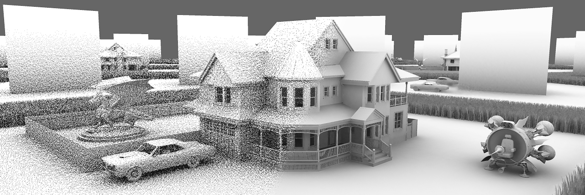

# D3D12 Raytracing Real-Time Denoised Ambient Occlusion sample

**Figure** *A render of raytraced Ambient Occlusion via our method. The AO is raytraced at 1 ray per pixel (left), and then spatio-temporally denoised with an edge-aware filter (right). The reconstruction successfully maintains a lot of detail while smoothing out much of the noise even at the low sampling rate.*

[[YouTube video preview and explanation of the sample (watch at 4K@60)]](https://www.youtube.com/watch?v=3EdE38iRn2A)

This sample demonstrates a combination of established denoising techniques for raytraced Ambient Occlusion (AO). It employs spatio-temporal accumulation and denoising of AO rays cast at 1 (or 0.5) sample rays per pixel (spp). The sample supports full-resolution and quarter-resolution RTAO; quarter-resolution output is bilaterally upsampled. The implementation provides a starting point that developers can experiment with and extend. See the second part of this readme for details on the denoiser implementation.

In addition, this DXR sample shows an implementation of:
* A specular pathtracer with physically-based shading (PBR)
* Support for dynamic geometries in an acceleration structure 

The sample assumes familiarity with Dx12 programming and DirectX Raytracing concepts introduced in the [D3D12 Raytracing Procedural Geometry sample](../D3D12RaytracingProceduralGeometry/readme.md). 

## Usage
D3D12RaytracingRealTimeDenoisedAmbientOcclusion.exe [...]
* [-forceAdapter \<ID>] - create a D3D12 device on an adapter <ID>. Defaults to adapter 0
* [-vsync] - renders with VSync enabled
* [-disableUI] - disables GUI rendering

The sample defaults to a 1080p window and full-resolution RTAO. The QuarterRes UI option instead generates and denoises AO at quarter resolution and then bilaterally upsamples it.

### UI
The title bar of the sample provides runtime information:
* Name of the sample
* Frames per second
* GPU[ID]: name

The GUI menu in the top left corner provides a runtime information and a multitude of dynamic settings for the Scene, RTAO and the Denoiser components. 
* UP/DOWN - navigate among the settings 
* LEFT/RIGHT - change the setting
* Backspace - toggles the settings menu ON/OFF. If "Display Profiler" is enabled, it toggles between settings menu and a profiler UI.

### Controls
* ALT+ENTER - toggles between windowed and fullscreen modes
* W,S - moves camera forward and back
* A,D - moves camera to the side
* Shift - toggles camera movement amplitude
* Hold left mouse key and drag - rotate camera's focus at position
* Hold right mouse key and drag - rotate scene
* L - enable/disable light animation
* C - enable/disable camera animation
* T - toggles scene animation
* 0 - Toggles Ground Truth spp vs 1 spp and switches to raw RTAO visualization
* 1 - Raw/single frame RTAO visualization
* 2 - Denoised RTAO visualization
* 3 - Specular PBR Pathtracer + RTAO visualization
* 4 - Toggles RTAO ray lengths - short | long
* ENTER - Toggles RTAO ON/OFF in "Specular PBR Pathracer + RTAO visualization mode"
* F9 - does a profiling pass. Renders 1000 frames, rotates camera 360 degrees and outputs GPU times to Profile.csv
* space - pauses/resumes rendering
* U/Y - moves car by the house back and forth
* J/M - moves spaceship up and down
* H/K - rotates spaceship around scene's center
* ESC - terminate the application

## PIX support
Set API mode to "D3D12 (ignore D3D11)" from "Auto" in PIX when launching the sample from PIX to take a capture. The sample enables PIX marker instrumentation under Debug and Profile configs.

## Requirements
* Requires DXR capable HW and SW. Consult the main [D3D12 Raytracing readme](../../readme.md) for requirements.

## Known Issues\Limitations
* UI "Sample set distribution across NxN pixels* set to true is only compatible with 1 spp (default). The distribution UI value will get forced to 1 if you select 2+ spp.

## Acknowledgements
* The grass straw generation is based on Emerald Engine implementation https://github.com/lragnarsson/Emerald-Engine
* The PBRT parser is based on Duos renderer implementation https://github.com/wallisc/DuosRenderer/tree/DXRRenderer/PBRTParser
* Assets used in this sample:
  * A pbrt-v3 version of 'Victoryan Style House' by MrChimp2313, downloaded from https://benedikt-bitterli.me/resources/, released under a [CC0 license](https://creativecommons.org/publicdomain/zero/1.0/).
  * A pbrt-v3 version of 'Pontiac GTO 67' by thecali, downloaded from https://benedikt-bitterli.me/resources/, released under a [CC0 license](https://creativecommons.org/publicdomain/zero/1.0/).
  * A pbrt-v3 version of 'Dragon' by Delatronic, downloaded from https://benedikt-bitterli.me/resources/, released under a [CC-BY license](https://creativecommons.org/licenses/by/3.0/).
  * A pbrt-v3 version of '4060.b Spaceship' by thecali, downloaded from https://benedikt-bitterli.me/resources/, released under a [CC0 license](https://creativecommons.org/publicdomain/zero/1.0/).
  * An environment map 'Flower Road', downloaded from https://hdrihaven.com/hdri/?c=outdoor&h=flower_road, released under a [CCO license](https://creativecommons.org/publicdomain/zero/1.0/).

See the sideloaded License.txt next to each asset for further license information.

# Sample implementation details
## Motivation
AO is a cheap approximation for global illumination that is more appropriate for real-time graphics on a budget. AO can significantly improve the realism of rendered 3D scenes. It approximates the amount of indirect lighting that bounces around the scene and reaches a point on a surface. The premise of AO is that any geometry directly visible in a hemisphere around a surface point act as an occluder that lower the ambient coefficient, making the surface appear darker. A surface lit with such dynamic indirect lighting, provides us with more cues about its shape and placement among other objects in the scene and, therefore, resulting in a visually more convincing look. 

AO approximates one aspect of indirect lighting and is commonly used alongside Global Illumination (GI) models. Game engines have implemented AO either by prebaking it into textures, which limits it to static object layouts, or through screen-space approximations, which have access to only the geometry visible on screen. Screen-space limitations can create false dark halos, omit occlusion from off-screen geometry, and destabilize occlusion around screen borders. Raytraced AO evaluates visibility against scene geometry instead of only screen-space data.

The physically-based approach to estimating AO is Monte Carlo sampling of the hemisphere around a surface normal and testing visibility by tracing rays. Rays that hit objects increase occlusion and lower the ambient-lighting term. This estimate is noisy at low sample counts and can require hundreds of rays per pixel to approach a ground-truth result. This sample demonstrates denoising a 1 spp raytraced AO input.
 
## Input to AO raytracer
The sample implements a specular physically-based (PBR) pathtracer to calculate per-pixel color. It casts radiance and shadow rays as the rays bounce around the scene. AO rays are raytraced and denoised in a separate pass, allowing each pass to process one ray type and providing an opportunity to pre-sort the AO rays. The denoiser supports a single AO value per pixel and, because it depends on per-pixel normal, depth, and motion-vector data, implicitly requires each pixel to represent only a single surface hit point. This is not always the case because the pathtracer can hit multiple surfaces for a single camera ray. To address this, the pathtracer uses a heuristic to pick a single surface hit: the hit position with the highest perceived material luminance. That luminance depends on the surface material's albedo scaled by the radiance ray's contribution. All other surfaces receive a constant ambient term when a radiance ray hits a surface.

## AO raytracing
The sample supports two AO raytracing execution modes: 
* standard 2D DispatchRays()
* pre-sorting AO rays and then executing 1D DispatchRays() over an input buffer of sorted rays.

### Checkerboard/0.5 spp
The sample also supports checkerboard sampling: it traces rays for pixels in an alternating checkerboard pattern from frame to frame. With a 1 spp setting, this traces 0.5 spp per frame. The denoiser accepts this checkerboard AO input.
#### Limitation 
* Raysorting implemention supports 1 or lower spp only.
* The checkerboard sampling is supported on the sorted raytraced AO path. Currently, standard 2D DispatchRays() path doesn't skip over inactive pixels. This is trivial to extend should you need it. 

### Sampling
Random samples for sampling of a hemisphere with AO rays are generated with a cosine weighted multi-jittered sampler (see Section 5.3.4 in book *Ray Tracing from the Ground Up*). Given low spp requirements of the sample, generating 1 sample sample sets per pixel would result in poor sampling quality of a hemisphere. Instead the sample generates sample sets for NxN pixels (i.e. 8x8). Then each pixel from NxN pixel set randomly picks a unique sample from this set at raytrace time. This way the hemisphere sampling is improved across local pixel neighborhoods making the local denoising even more effective at sampling the hemisphere. As long as the local neighborhoods (i.e. 8x8 pixels) are spatially close, have similar surface normal and denoiser blurs among them, the sampling quality is improved. 

#### Limitations
* NxN sample set distribution is only supported for 1 spp. On 2+ spp settings, it will use 1x1 sample set distribution. This is trivial to extend should you need it.

## Ray sorting
Calculating AO means sampling a hemisphere, so neighboring AO rays can have different directions. The sample provides an optional compute-based pre-sort for each 64x128-pixel region and then dispatches the sorted rays with a 1D `DispatchRays()`. Rays are hashed and sorted similarly to *Costa et al. 2014, Ray Reordering Techniques for GPU Ray-Cast Ambient Occlusion*. The hash uses an 8-bit encoded octahedral ray direction and does not include ray-origin depth.

### Ambient coefficient
Sample applies a non-linear function to calculate ambient coefficient based on the AO ray's hit distance. This provides an artistic control to fine-tune how quickly ambient occlusion falls off with AO ray hit distance.

#### Approximating interreflections
AO tends to overdarken the GI effect because it assumes occluders do not emit or reflect light. Checking the reflected light from each occluder would move the technique toward a GI solution. Instead, the sample implements the approximation to interreflections from Chapter 11.3.3 of *Real-Time Rendering (4th edition)*. The approximation modulates the ambient coefficient using the surface albedo, based on the assumptions that lighter surfaces reflect more light and nearby surfaces tend to have similar colors.

## Real-Time AO Denoiser
The sample implements a spatio-temporal denoiser based on *Schied et al. 2017, Spatiotemporal Variance-Guided Filtering: Real-Time Reconstruction for Path-Traced Global Illumination* (SVGF). It uses normal, depth, motion-vector, and variance buffers to drive an edge-stopping filter. Temporal supersampling increases temporally accumulated spp (tspp), reduces noise, and allows less-aggressive spatial filtering. As in the paper, temporal supersampling accumulates the denoised value rather than the per-frame raytraced value. This trades some temporal lag for a smoother accumulated result. The implementation uses consistency checks and clamping to limit ghosting when the camera, objects, or occluders move.

### Temporal supersampling
Temporal supersampling accumulates per-frame samples over multiple frames to produce a higher temporally accumulated tspp. The result is less noisy and closer to the ground truth. It is important to accumulate only valid AO values; otherwise the cached result can suffer from ghosting or lag. A surface's AO can change when either its hit position or the occluders around it change, so the denoiser applies two stages to handle these cases.

#### Stage 1: Reverse reprojection
First temporal stage reprojects each pixel from the current frame into the previous frame and looks up an AO value from the cache using motion vector data. If the reprojected pixel corresponds to a pixel center it takes that AO value, otherwise it interpolates the value from a 2x2 pixel neighborhood. The AO value(s) are bilaterally weighted using depth and normal buffers to only accumulate AO values that correspond to the same point on a surface. This stage can be run before raytracing AO and, thus, provide information such as per-pixel tspp to drive spp for raytracing AO in the current frame. 

#### Stage 2: Blending current frame value with the reprojected cached value
The second stage blends the current-frame raytraced AO value with the reprojected cached value for each pixel. The denoiser keeps a single temporal cache and accumulates values via exponential weighting: *AO(i) = lerp(AO(new), AO(i-1), a)*, where *a = 1 / tspp*. The current value therefore receives more weight at low tspp and less weight at higher tspp. Tspp is capped so previously accumulated values are eventually replaced as the scene changes. To further limit ghosting, the stage clamps the cached AO value to an expected range based on the current frame, following *Salvi 2016, An Excursion in Temporal Supersampling*. The expected range is the local mean +/- standard deviation. Because a 1 spp input is noisy, the sample uses a 9x9 variance kernel by default; these settings can be adjusted for a particular scenario.

### Filtering
Filtering is done in two stages. The first performs one fullscreen 3x3 bilateral-blur pass, compared with the five 5x5 passes described by SVGF. Because the temporal denoiser accumulates the denoised result, the smoothing builds over multiple frames. The second stage applies a stronger filter to recently disoccluded pixels with low tspp. Once pixels accumulate enough tspp, only the first-stage filter is applied to them.

#### Stage 1: Fullscreen blur
The fullscreen blur applies a single 3x3 bilateral-filter pass similar to SVGF. It uses an adaptive kernel size based on the temporally accumulated ray-hit distance and output denoising quality described in *Chapter 19, Ray-Tracing Gems*. The denoiser varies the kernel size between a minimum width and a target adaptive width on alternating frames to provide different spatial coverage over time.

#### Stage 2: Disocclusion blur
The second stage addresses recently disoccluded pixels with a stronger 3x3 multi-pass blur and more relaxed depth-aware constraints. The depth constraints still prevent blur across significant pixel-to-pixel depth differences. This filter is applied only to pixels with low tspp, and its strength decreases as tspp increases over subsequent frames.

## Other sample information
### Pathtracer
#### Motion vectors
Motion vectors represent a screen space uv difference for a surface hit from a previous to a current frame. Thus given a curent frame pixel and a motion vector we can look up a cached value in the previous frame buffer. Motion vector is an input to temporal supersampling's reverse reprojection stage. Since surfaces can appear and disappear, the reprojection stage has to apply consistency checks to validate that the cached value corresponds to the same/similar enough surface point.

This sample provides an implemention of motion vector calculation that supports animated camera and animated objects reflected of animated planar reflectors. The motion vector for reflected objects is calculated by unwinding an object's virtual position at each reflection bounce. A virtual position is a position of an object that would render at the same screen space position and depth if it wasn't reflected. For a single reflection, a virtual position is simply a mirror reflection of the reflected position around the mirror plane; i.e. ending up behind the mirror plane. 
 
### Dynamic geometry
The sample supports dynamic updates both to BLAS world transforms and geometry vertices. TLAS is rebuilt every frame picking up active BLAS instances with updated world transforms. BLASes that have had their vertex geometry changed are rebuilt.

#### Dynamic Vertex Geometry
The grass patches are the only objects with dynamic vertex geometry in the scene. They are built as patches of grass blades, i.e. 100x100 grass blades, with each blade consisting of 5 triangles generated via a Compute Shader ([GenerateGrassStrawsCS.hlsl](util/GenerateGrassStrawsCS.hlsl)) based on input parameters and a wind map texture. The blade generation is based on [Emerald's engine implementation](https://github.com/lragnarsson/Emerald-Engine). The grass geometry adds high-frequency detail to the scene making it a good stress test for AO Raytracing and Denoising. Rendering of this type of geometry is very prone to aliasing. To lower the alias, the grass CS generator generates multiple grass patches, one for each LOD. Each LOD has its own vertex buffer. The LODs differ primarily in wind strength so that the patches further away move less. Each LOD is built as a separate BLAS and there can be multiple BLAS instances associated with each LOD BLAS. Every frame, the app maps a grass patch BLAS instance to a BLAS/LOD based on its distance to a camera. Therefore, a BLAS instance's LOD can change from a frame to frame.

Temporal reprojection needs to be able to find vertices of a triangle that was hit in the current frame in the previous frame. Since the LOD can change, the previous frame vertex buffers that need to be sampled when calculating motion vectors change. This scenario is handled by creating shader records for all cases of LOD transitions for all LODs. Then, on geometry/instance updates, a BLAS instance updates its InstanceContributionToHitGroupIndex to point to the corresponding shader records for that LOD and the LOD transition. 

	// Dynamic geometry with multiple LODs is handled by creating shader records
	// for all cases. Then, on geometry/instance updates, a BLAS instance updates
	// its InstanceContributionToHitGroupIndex to point to the corresponding 
	// shader records for that LOD. 
	// 
	// The LOD selection can change from a frame to frame depending on distance
	// to the camera. For simplicity, we assume the LOD difference from frame to frame 
	// is no greater than 1. This can be false if camera moves fast, but in that case 
	// temporal reprojection would fail for the most part anyway yielding diminishing returns.
	// Consistency checks will prevent blending in from false geometry.
	//
	// Given multiple LODs and LOD delta being 1 at most, we create the records as follows:
	// 2 * 3 Shader Records per LOD
	//  2 - ping-pong frame to frame
	//  3 - transition types
	//      Transition from lower LOD in previous frame
	//      Same LOD as previous frame
	//      Transition from higher LOD in previous frame

				
## Potential improvements
There are multiple opportunities to extend the denoised RTAO implementation.
* **RTAO**
  * **Variable rate sampling**. For example, the sampling could be adjusted depending on tspp of a pixel. Temporal reprojection pass can be run before current's frame AO raytracing and thus provide the per pixel tspp information. In fact, the current denoiser already splits temporal reprojection and blending step and supports the dual stage denoising.
  * **Use a better sampler**:
    * Take a look at addressing sample clumping that's visible at raw 1 spp AO visualization. For example [Correlated Multi-Jittered Sampling](http://graphics.pixar.com/library/MultiJitteredSampling/paper.pdf) has become popular way to lower clumping.
     * There's a potential to detect undersampled parts of the hemisphere given the accumulated samples over time and improve coverage of the tspp. Take a look at using a progressive sampling technique that for better aggregated sample coverage over time.
  * **Combine ray generation and sorting**. AO ray generation and ray sorting are currently separate compute passes and could be combined.
* **Denoiser**
  * **Higher depth bits allocation**. Consider increasing depth bit allocation to improve depth testing when filtering and upsampling. The sample uses 16b depth and 16b encoded normals to lower bandwidth requirements. However, given the high exponent (64) used for normal testing, it might be worthwhile to trade some of the bits from normals to a depth data as the depth test is more strict. For example, the allocation could be 24b for depth and 8b for encoded normal. This would be only for denoising. 8b normal encoding would likely adversely impact AO ray sampling quality if used in AO ray generation.
  * **Upsampling** could be improved to find better candidates from low res inputs. Either by increasing the 2x2 sampling quad and/or improving the depth test to be more strict by testing against expected depth at the source low-res sample offset instead of the current test target depth +/- threshold.
  * **Disocclusion blur**. The current implementation uses a 3x3 separable filter and runs three times with varying kernel steps. Other kernel sizes, step sizes, and iteration counts could be explored.
  * **Local variance estimate**. Calculate local variance with a depth-aware filter using relaxed weights, similar to the disocclusion blur. The current local variance uses a separable filter without bilateral weights. The depth-test strictness should be parameterized so it rejects pixels that are far apart while retaining enough samples for a stable estimate.
  * **Temporal gradients to discard stale temporal cache values**. You can recast rays from previous frame for a subset of samples (i.e. 1 ray per 3x3 pixels) and calculate temporal gradients to more directly evaluate amount of local change to detect and discard stale temporal cache values as per Schied et al. "Gradient Estimation for Real-Time Adaptive Temporal
Filtering". Clamping of cached values works well for substantial AO changes in the scene and/or for areas where local variance is small. Temporal gradient samples, however, are much more precise at determining amount of change from frame to frame.

There are also few areas in the sample which you should consider to improve in your implementation if porting/integrating the sample code over: 
* **Acceleration Structure**
  * **Build scheduling**. Use a separate scratch resource for each BLAS build to avoid requiring a UAV barrier between builds.
  * **BLAS compaction**. Compact static BLAS resources.
