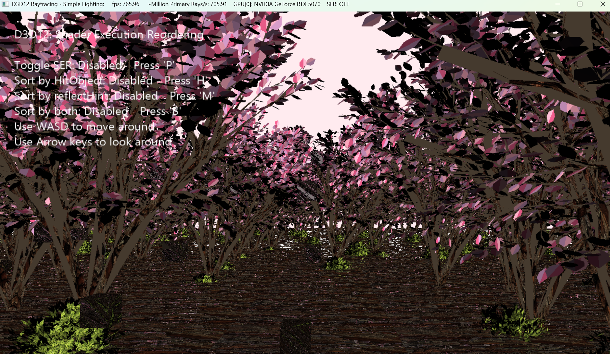

# D3D12 Raytracing Shader Execution Reordering Sample - Sakura Scene

The scene features multiple geometry instances, each assigned a distinct materialID via the shader table. Shader Execution Reordering (SER) is demonstrated using three modes: sorting by HitObject, sorting by a materialID key derived from the shader table, and a combined mode that uses both. This sample is built on the D3D12RaytracingSimpleLighting sample.

## Usage
D3D12RaytracingBasicShaderExecutionReordering.exe

Additional arguments:
  * [-forceAdapter \<ID>] - create a D3D12 device on an adapter \<ID>. Defaults to adapter 0.

### UI
The title bar of the sample provides runtime information:
* Name of the sample
* Frames per second
* Million Primary Rays/s: a number of dispatched rays per second calculated based of FPS.
* GPU[ID]: name
* SER: ON/OFF - toggles shader execution reordering feature on/off.

### Controls
* ALT+ENTER - toggles between windowed and fullscreen modes.
* S - toggles shader execution reordering on/off.
* H - MaybeReorderThread() based on HitObject
* M - MaybeReorderThread() based on materialID
* B - MaybeReorderThread() based on both HitObject and materialID
* WASD - move the camera around the scene. (W - forward, A - left, S - backward, D - right))
* Up/Down - move the camera up/down.

## Requirements
* Windows 10 with the October 2018 update or higher.
* Consult the main [D3D12 Raytracing readme](../../readme.md) for further requirements.