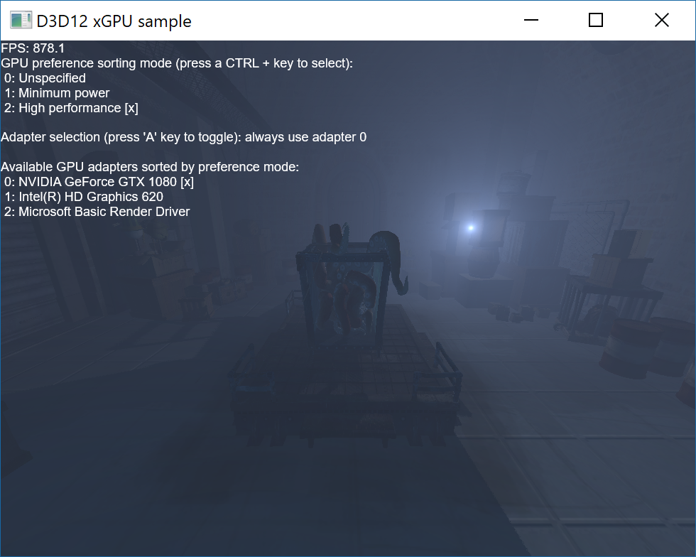

# xGPU sample

This sample illustrates how to detect and handle a D3D device removed event. Particularly in a case of an external GPU (xGPU) being plugged/unplugged. When a device is removed, any further D3D commands will fail with DXGI_ERROR_DEVICE_REMOVED. The sample detects this, destroys D3D resources and recreates them on the next available adapter. Then it continues rendering the next frame while retaining application and scene state. The adapter is selected based on a GPU sorting mode applied by the application. Note, the application selected sorting mode will be superseded by a global preference for the application if there is one. The global preference for an application can be set by a user on the Advanced graphics settings page which can be found as a link from the Display section of Windows Settings.

Another important event is when a new GPU is plugged into the system. The sample uses IDXGIFactory7::RegisterAdaptersChangedEvent() to register for event notifications when this happens. At that time, the sample re-enumerates adapters and if a better adapter is found according to the GPU sorting mode, the application recreates all D3D resources using the new adapter.

As the sample is able to survive an adapter removal event, it declares that it supports adapter removal via DXGIDeclareAdapterRemovalSupport API. This allows Windows to identify such apps and act accordingly, for example, to allow safe detachment of the xGPU even when this application is rendering on it. This behavior is also successfully tested via [DXGIAdapterRemovalSupportTest.exe](../../../Tools/DXGIAdapterRemovalSupportTest/readme.md).

### Controls
* ALT+ENTER - toggles between windowed and fullscreen modes.
* CTRL+[1-9] - gpu preference sorting mode selection.
* A - override for manual adapter selection.
* [1-9] - adapter selection, when manual override is enabled.

## Requirements
* Windows 10 17655 or higher (available via [Windows Insider Program](https://insider.windows.com/en-us/))
* [Visual Studio 2017](https://www.visualstudio.com/) with the Windows 10 17655 SDK