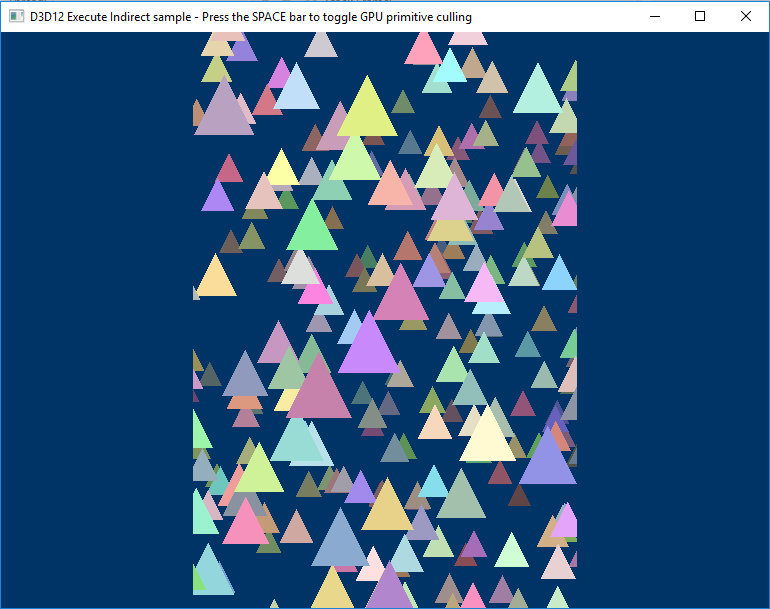

# Direct3D 12 execute indirect sample

This sample demonstrates how to generate dynamic GPU workloads using the graphics command list's [**ID3D12GraphicsCommandList::ExecuteIndirect**](https://docs.microsoft.com/windows/win32/api/d3d12/nf-d3d12-id3d12graphicscommandlist-executeindirect) API. In this sample, a large number of triangles animate across the screen, and a compute shader is used to determine which triangles are visible. The draw calls for those triangles are then aggregated into a buffer that is processed by the ExecuteIndirect API so that only those triangles are processed by the graphics pipeline.

### Controls
SPACE bar - toggles the compute shader on and off.

### Optional features
This sample has been updated to build against the Windows 10 Anniversary Update SDK. In this SDK a new revision of Root Signatures is available for Direct3D 12 apps to use. Root Signature 1.1 allows for apps to declare when descriptors in a descriptor heap won't change or the data descriptors point to won't change.  This allows the option for drivers to make optimizations that might be possible knowing that something (like a descriptor or the memory it points to) is static for some period of time.
