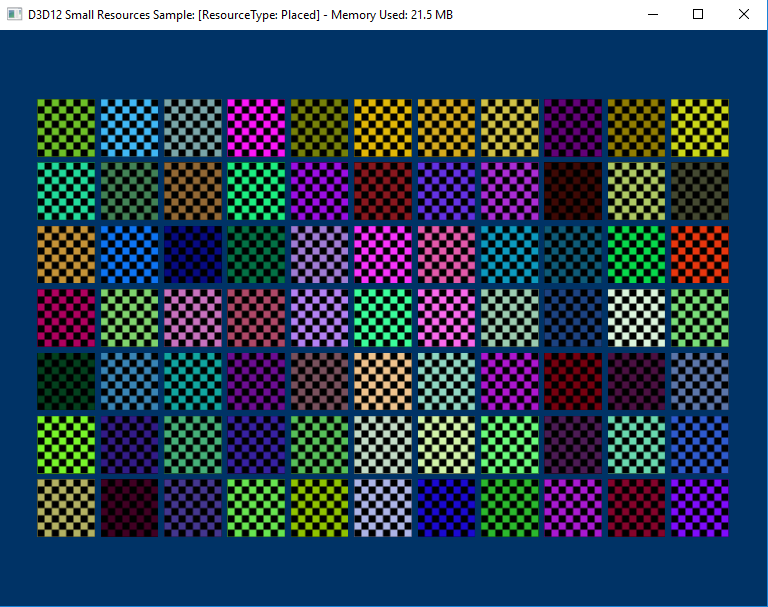

# Direct3D 12 small resources sample

This sample demonstrates the use of small placed resources in Direct3D 12. The sample allocates a number of small textures using 4K resource alignment and shows the potential memory savings gained by using placed resources over committed and reserved resources which use 64K resource alignments. The resource type and current GPU memory usage are displayed in the window's title bar.

### Controls
SPACE bar - toggles between using placed and committed resources.

### Optional features
This sample has been updated to build against the Windows 10 Anniversary Update SDK. In this SDK a new revision of Root Signatures is available for Direct3D 12 apps to use. Root Signature 1.1 allows for apps to declare when descriptors in a descriptor heap won't change or the data descriptors point to won't change.  This allows the option for drivers to make optimizations that might be possible knowing that something (like a descriptor or the memory it points to) is static for some period of time.